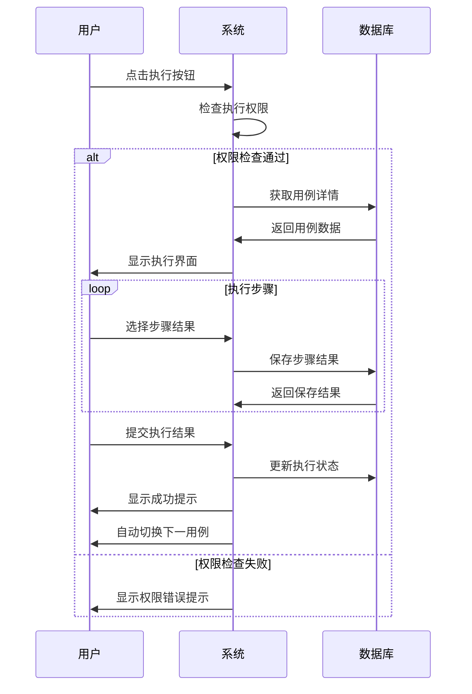
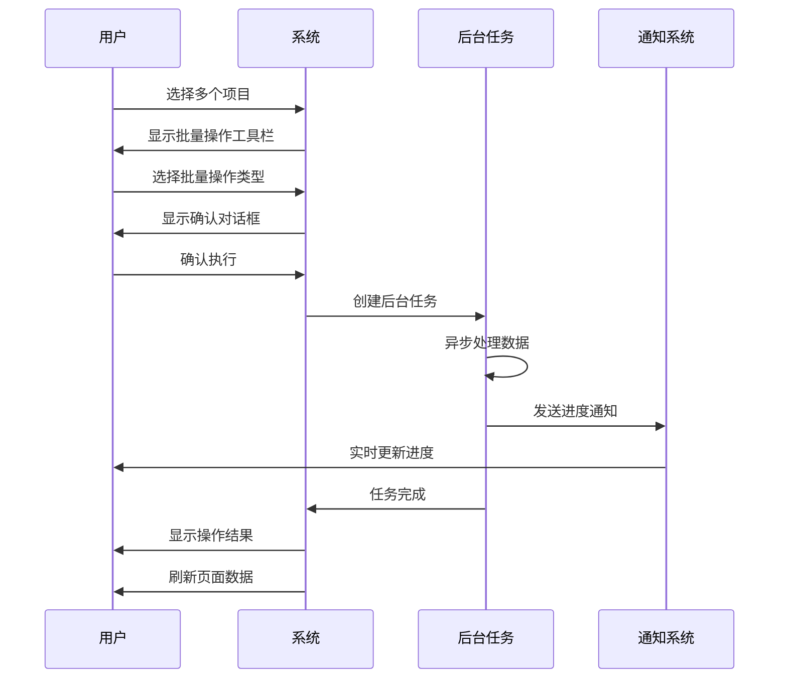
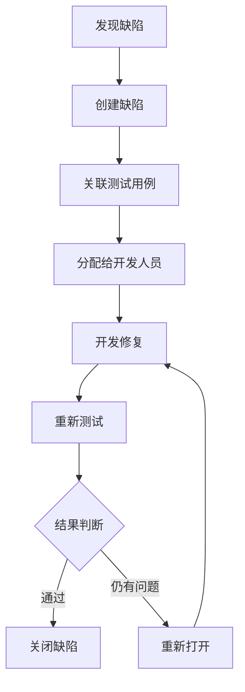
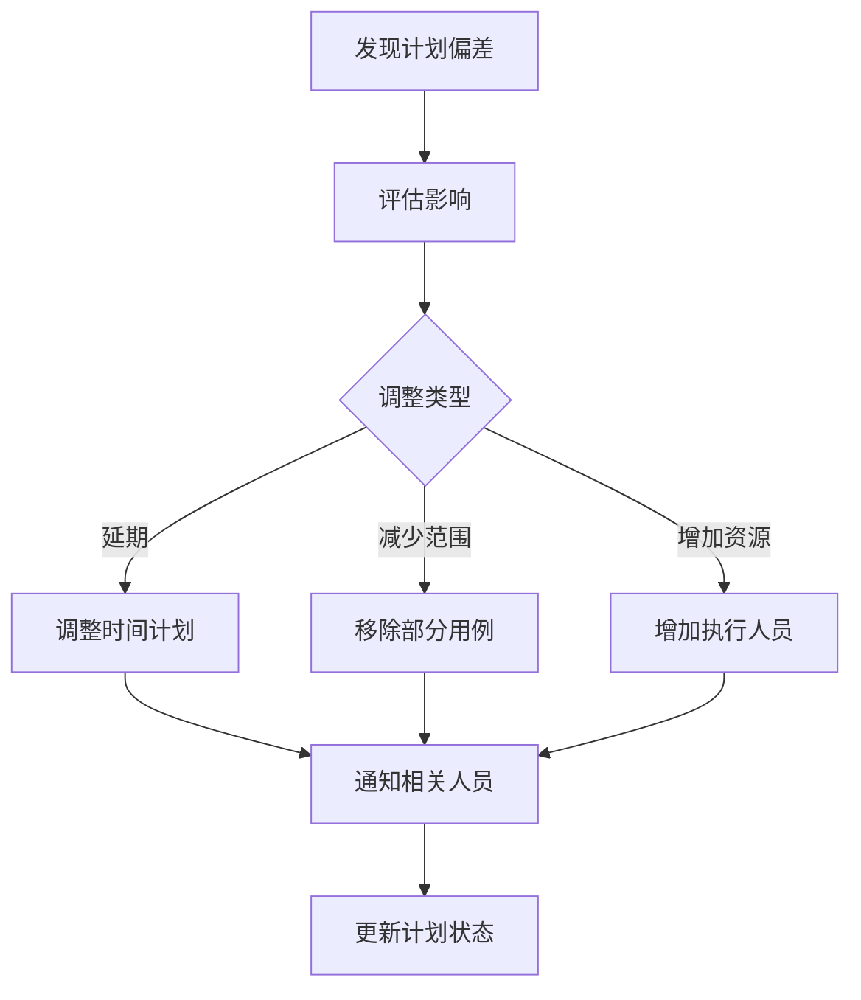

# 测试管理插件产品需求知识库

> 📋 本文档面向产品经理、需求分析师和需求Agent，提供完整的业务功能、用户场景、交互规范和需求模板，作为需求细化和产品设计的参考基础。

## 🎯 产品定位

**产品价值主张**: 为企业团队提供全流程测试管理解决方案，覆盖测试用例管理、测试计划执行、缺陷跟踪和测试报告生成的完整工作流。

**核心解决的问题**:
1. **用例管理分散** → 统一的用例库管理
2. **执行效率低下** → 可视化执行界面和批量操作
3. **进度难以追踪** → 实时状态统计和进度看板
4. **报告生成复杂** → 自动化报告生成和模板管理
5. **团队协作困难** → 权限控制和任务分配机制

## 👥 用户角色和权限体系

### 主要用户角色

#### 1. 测试工程师 (Tester)
**主要职责**: 执行测试用例，记录测试结果，管理缺陷
**核心需求**:
- 快速找到需要执行的测试用例
- 高效的测试执行界面
- 便捷的缺陷创建和关联
- 清晰的任务进度跟踪

**关键操作路径**:


#### 2. 测试经理 (Test Manager)
**主要职责**: 规划测试计划，分配测试任务，监控执行进度
**核心需求**:
- 创建和管理测试计划
- 批量分配测试任务
- 实时监控执行进度
- 生成测试报告

**关键操作路径**:


#### 3. 用例管理员 (Case Admin)
**主要职责**: 管理测试用例库，维护用例质量
**核心需求**:
- 组织用例库结构
- 审核用例质量
- 批量导入导出用例
- 维护用例关联关系

#### 4. 系统管理员 (System Admin)
**主要职责**: 配置系统参数，管理用户权限
**核心需求**:
- 配置系统集成参数
- 管理用户权限和角色
- 维护报告模板
- 监控系统性能

### 权限矩阵

| 功能模块 | 测试工程师 | 测试经理 | 用例管理员 | 系统管理员 |
|---------|-----------|----------|-----------|-----------|
| 查看用例 | ✅ | ✅ | ✅ | ✅ |
| 创建用例 | ❌ | ✅ | ✅ | ✅ |
| 编辑用例 | ❌ | ✅ | ✅ | ✅ |
| 删除用例 | ❌ | ❌ | ✅ | ✅ |
| 执行测试 | ✅(仅分配给自己的) | ✅ | ❌ | ✅ |
| 创建计划 | ❌ | ✅ | ❌ | ✅ |
| 分配任务 | ❌ | ✅ | ❌ | ✅ |
| 生成报告 | ❌ | ✅ | ❌ | ✅ |
| 系统配置 | ❌ | ❌ | ❌ | ✅ |

## 🏢 业务场景和用户旅程

### 场景1: 新版本测试
**业务背景**: 软件新版本发布前的全面测试
**参与角色**: 测试经理、测试工程师
**业务流程**:

1. **测试经理创建测试计划**
   - 设置计划名称和时间范围
   - 选择相关功能模块的用例
   - 分配执行人员和截止时间

2. **测试工程师执行测试**
   - 登录系统查看分配的任务
   - 按优先级顺序执行用例
   - 记录实际结果和附件
   - 发现问题时创建缺陷

3. **进度监控和调整**
   - 测试经理实时查看执行进度
   - 处理阻塞问题和资源调配
   - 根据进度调整计划安排

4. **报告生成和发布**
   - 自动生成测试报告
   - 发送给相关干系人
   - 归档测试数据

### 场景2: 回归测试
**业务背景**: 代码修改后的回归测试
**关键需求**: 快速筛选相关用例，高效执行测试
**特殊考虑**: 
- 需要基于影响范围筛选用例
- 支持自动化测试结果导入
- 快速生成回归测试报告

### 场景3: 敏捷迭代测试
**业务背景**: 敏捷开发中的迭代测试
**关键需求**: 
- 快速创建测试计划
- 灵活调整测试范围
- 实时反馈测试结果

## 💼 功能需求清单

### 1. 测试用例库功能

#### 1.1 用例管理
| 功能点 | 优先级 | 业务价值 | 使用频率 |
|--------|--------|----------|----------|
| 创建用例 | P0 | 高 | 每日 |
| 编辑用例 | P0 | 高 | 每日 |
| 复制用例 | P1 | 中 | 每周 |
| 删除用例 | P1 | 中 | 每周 |
| 批量导入Excel | P0 | 高 | 每周 |
| XMind导入 | P2 | 中 | 每月 |
| 版本管理 | P1 | 中 | 每周 |

#### 1.2 目录管理
| 功能点 | 优先级 | 业务价值 | 约束条件 |
|--------|--------|----------|----------|
| 创建目录 | P0 | 高 | 最大8级层次 |
| 重命名目录 | P1 | 中 | 不能与同级重名 |
| 移动目录 | P1 | 中 | 不能移动到子目录 |
| 删除目录 | P1 | 中 | 需要先清空或转移用例 |
| 拖拽排序 | P1 | 中 | 只在同级目录内 |

#### 1.3 视图模式
- **列表视图**: 默认视图，支持排序筛选
- **脑图视图**: 可视化展示用例结构关系
- **视图切换**: 保持筛选条件，切换展示方式

### 2. 测试计划功能

#### 2.1 计划管理
| 功能点 | 业务规则 | 交互说明 |
|--------|----------|----------|
| 创建计划 | 必填：名称、时间范围 | 支持模板快速创建 |
| 编辑计划 | 进行中的计划限制编辑 | 提示影响范围 |
| 删除计划 | 需要确认操作 | 显示关联的执行任务数量 |
| 复制计划 | 复制结构，不包含执行记录 | 需要重新设置时间和人员 |

#### 2.2 用例规划
| 功能点 | 业务规则 | 交互说明 |
|--------|----------|----------|
| 添加用例到计划 | 检查用例状态是否允许规划 | 支持批量添加 |
| 移除计划用例 | 已执行的用例需要确认 | 提示执行进度 |
| 生成执行任务 | 根据负责人和模块分组 | 支持自定义分组策略 |

### 3. 测试执行功能

#### 3.1 执行界面设计
**界面布局**: 
- 左侧显示测试用例信息
- 右侧分标签页显示: 测试步骤、执行结果、缺陷管理、附件管理

**交互特性**:
- 支持键盘快捷键操作 (Alt+P通过、Alt+F失败)
- 自动切换下一测试用例
- 实时保存执行进度

#### 3.2 状态管理规则
```typescript
// 执行状态定义
enum TestRunStatus {
  PENDING = 'pending',    // 待执行
  IN_PROGRESS = 'in_progress', // 执行中
  PASSED = 'passed',      // 通过
  FAILED = 'failed',      // 失败
  BLOCKED = 'blocked',    // 阻塞
  SKIPPED = 'skipped'     // 跳过
}
```

**状态流转规则**:
- 只有分配的执行人可以更新状态
- 失败状态必须关联缺陷或说明原因
- 阻塞状态需要填写阻塞原因
- 跳过状态需要管理员权限

### 4. 测试报告功能

#### 4.1 报告类型
| 报告类型 | 使用场景 | 生成周期 | 数据源 |
|----------|----------|----------|--------|
| 计划执行报告 | 测试计划完成后 | 按需 | 执行数据 |
| 缺陷统计报告 | 质量分析 | 每周/每月 | 缺陷数据 |
| 用例覆盖报告 | 测试覆盖分析 | 按需 | 用例和代码关联 |
| 趋势分析报告 | 质量趋势分析 | 每月 | 历史数据 |

#### 4.2 报告模板配置
- **标准模板**: 系统预置的报告模板
- **自定义模板**: 支持Word模板自定义
- **数据源绑定**: 灵活的数据源配置机制

## 🎨 交互设计规范

### UI设计原则

#### 1. 一致性原则
- **视觉一致**: 统一的色彩、字体、图标系统
- **交互一致**: 相同操作的交互模式保持一致
- **信息架构一致**: 相似功能的页面布局保持一致

#### 2. 效率优先原则
- **快捷操作**: 常用功能提供快捷方式
- **批量操作**: 支持批量处理提升效率
- **键盘支持**: 重要操作支持键盘快捷键

#### 3. 容错性原则
- **操作确认**: 危险操作需要用户确认
- **撤销机制**: 支持操作撤销
- **渐进式披露**: 复杂功能分步骤展示

### 标准交互模式

#### 1. 列表页面交互模式
```
标准布局：
┌─────────────────────────────────────┐
│ 页面标题 + 新建按钮 + 视图切换        │
├─────────────────────────────────────┤
│ 搜索框 + 筛选器 + 批量操作工具栏     │
├─────────────────────────────────────┤
│ 数据表格 (支持排序、分页、多选)      │
├─────────────────────────────────────┤
│ 分页组件 + 统计信息                │
└─────────────────────────────────────┘
```

**交互规范**:
- 表格行悬停高亮显示
- 支持Ctrl/Cmd多选
- 右键菜单提供快捷操作
- 操作结果实时反馈

#### 2. 树形页面交互模式
```
标准布局：
┌────────────┬────────────────────────┐
│            │ 面包屑导航 + 操作按钮   │
│  目录树    ├────────────────────────┤
│  (可拖拽   │                        │
│   调整宽度) │  内容区域               │
│            │  (列表/表格/卡片)       │
│            │                        │
│            │                        │
└────────────┴────────────────────────┘
```

**交互规范**:
- 左侧树形结构支持拖拽排序
- 点击节点选中，双击展开
- 右键菜单提供上下文操作
- 面包屑显示当前位置

#### 3. 弹窗/抽屉交互模式
```
模态弹窗：
┌─────────────────────────────────────┐
│ 标题 + 关闭按钮                     │
├─────────────────────────────────────┤
│                                    │
│  内容区域 (表单/列表/详情)          │
│                                    │
├─────────────────────────────────────┤
│ 取消 + 确定 (操作按钮右对齐)        │
└─────────────────────────────────────┘
```

**交互规范**:
- 大尺寸内容使用抽屉组件
- 表单验证实时反馈
- 提交前确认重要操作
- 支持ESC键关闭

### 状态反馈设计

#### 1. 加载状态
- **页面加载**: 骨架屏 + 进度条
- **数据加载**: Loading图标 + 文字说明  
- **批量操作**: 进度条 + 实时计数
- **文件上传**: 进度条 + 上传速度

#### 2. 操作反馈
- **成功操作**: 绿色通知 + 成功图标
- **失败操作**: 红色通知 + 错误详情
- **警告信息**: 黄色提示 + 注意图标
- **信息提示**: 蓝色提示 + 信息图标

#### 3. 状态指示
- **用例状态**: 彩色圆点 + 状态文字
- **执行进度**: 进度条 + 百分比
- **在线状态**: 绿色圆点表示在线
- **权限状态**: 灰色图标表示无权限

## 📋 核心业务规则

### 用例管理规则

#### 1. 用例创建规则
```yaml
业务规则:
  - 用例名称不能重复 (同一目录内)
  - 用例名称长度限制 250 字符
  - 必须选择所属目录
  - 测试步骤至少包含一个步骤
  - 创建后状态为 "草稿"

验证规则:
  - 名称不能包含特殊字符: <>|*?/\
  - 不允许纯空格作为名称
  - HTML标签会被过滤

权限规则:
  - 用例管理员和测试经理可以创建
  - 测试工程师只读权限
```

#### 2. 用例状态流转规则
```yaml
状态流转:
  草稿 → 待审核: 任何有权限的用户
  待审核 → 已通过: 仅用例管理员
  待审核 → 草稿: 仅用例管理员 (退回)
  已通过 → 已废弃: 仅用例管理员
  已废弃 → 已通过: 仅用例管理员 (恢复)

规划限制:
  - 只有 "已通过" 状态的用例可以规划到计划
  - "已废弃" 状态的用例不可规划
  - 可通过配置修改状态规划规则
```

### 测试执行规则

#### 1. 执行权限规则
```yaml
执行权限:
  基础规则:
    - 只能执行分配给自己的测试用例
    - 管理员可以执行所有测试用例
    
  配置化权限 (可在系统配置中调整):
    - canOnlyExecuteMineCase: 是否只能执行自己的用例
    - allowExecuteOthersCase: 是否允许代执行他人用例
    
  特殊情况:
    - 用例未分配执行人时，任何有权限用户可执行
    - 紧急情况下管理员可临时授权
```

#### 2. 状态更新规则
```yaml
状态更新限制:
  - 只有执行人可以更新执行状态
  - 失败状态必须填写失败原因或关联缺陷
  - 阻塞状态需要说明阻塞原因
  - 跳过状态需要管理员授权

批量状态更新:
  - 支持批量设置为通过 (需确认)
  - 批量设置失败需要统一原因
  - 不支持批量设置为阻塞 (业务约束)
```

### 数据约束规则

#### 1. 层级限制
- **目录层级**: 最大8级目录深度
- **用例数量**: 单目录最大1000个用例 (性能考虑)
- **步骤数量**: 单用例最大50个测试步骤
- **附件大小**: 单文件最大10MB，总大小100MB

#### 2. 命名规范
- **目录命名**: 不能包含 / \ : * ? " < > |
- **用例命名**: 长度1-250字符，不能纯空格
- **计划命名**: 长度1-100字符，建议包含版本信息

## 🎮 交互流程详解

### 核心操作流程

#### 1. 用例执行流程


#### 2. 批量操作流程


### 错误处理流程

#### 1. 表单验证错误
- **实时验证**: 失焦时验证单个字段
- **整体验证**: 提交前验证所有字段
- **错误显示**: 字段下方显示红色错误信息
- **错误定位**: 自动滚动到第一个错误字段

#### 2. 网络请求错误
```yaml
错误处理策略:
  网络超时:
    - 显示: "网络超时，请重试"
    - 动作: 提供重试按钮
    
  服务器错误:
    - 显示: "服务异常，请稍后重试"
    - 动作: 记录错误日志，联系管理员
    
  权限错误:
    - 显示: "权限不足，请联系管理员"
    - 动作: 跳转到无权限页面
    
  数据冲突:
    - 显示: "数据已被他人修改，请刷新后重试"
    - 动作: 自动刷新页面数据
```

## 📝 需求模板

### 功能需求模板

```markdown
## 功能需求: [需求标题]

### 基本信息
- **需求编号**: REQ-YYYY-XXXX
- **提出人**: [姓名]
- **业务优先级**: P0/P1/P2/P3
- **预期版本**: [目标版本]
- **相关干系人**: [产品、开发、测试、运营]

### 业务背景
[描述为什么需要这个功能，解决什么问题]

### 用户角色
- **主要用户**: [描述主要使用者]
- **次要用户**: [描述其他涉及用户]
- **受影响用户**: [描述可能受影响的用户]

### 功能描述
#### 核心功能
[详细描述核心功能点]

#### 边界条件
[描述功能的边界和限制]

#### 业务规则
[列出重要的业务规则]

### 用户旅程


### 界面设计要求
#### 布局要求
[描述界面布局需求]

#### 交互要求
[描述交互方式和反馈]

#### 响应式要求
[描述不同设备的适配需求]

### 性能要求
- **响应时间**: [具体时间要求]
- **并发用户**: [支持用户数量]
- **数据量**: [处理的数据规模]

### 兼容性要求
- **浏览器**: [支持的浏览器版本]
- **设备**: [支持的设备类型]
- **集成**: [需要集成的系统]

### 测试验收标准
- [ ] 功能测试用例通过
- [ ] 性能测试达标
- [ ] 兼容性测试通过
- [ ] 用户体验测试满意

### 风险评估
#### 技术风险
[列出技术实现风险]

#### 业务风险
[列出业务影响风险]

#### 依赖风险
[列出外部依赖风险]

### 上线计划
- **开发时间**: [预计开发时间]
- **测试时间**: [预计测试时间]  
- **上线时间**: [预计上线时间]
- **推广计划**: [用户推广策略]
```

### 需求评估标准

#### 1. 优先级评估矩阵
| 影响范围 \ 紧急程度 | 高紧急 | 中紧急 | 低紧急 |
|-------------------|--------|--------|--------|
| **高影响** | P0 | P1 | P1 |
| **中影响** | P1 | P2 | P2 |
| **低影响** | P2 | P2 | P3 |

#### 2. 复杂度评估
- **简单 (1-2天)**: 界面文案修改、简单配置调整
- **中等 (3-5天)**: 新增表单字段、增加列表列
- **复杂 (1-2周)**: 新增页面功能、复杂业务流程
- **复杂 (2周+)**: 新模块开发、架构调整

#### 3. 影响范围评估
```yaml
影响范围类型:
  界面层:
    - 仅影响前端界面显示
    - 风险: 低
    - 测试: 前端功能测试
    
  业务逻辑层:
    - 影响业务处理流程
    - 风险: 中等
    - 测试: 业务流程测试
    
  数据模型层:
    - 涉及数据库结构变更
    - 风险: 高
    - 测试: 数据兼容性测试
    
  集成层:
    - 影响外部系统集成
    - 风险: 很高
    - 测试: 集成测试
```

## 🔄 业务流程标准

### 完整的测试管理工作流

#### 阶段1: 测试准备
```yaml
用例准备:
  负责人: 用例管理员/测试经理
  主要工作:
    - 分析需求，设计测试用例
    - 组织用例库结构
    - 审核用例质量
    - 维护用例版本

输入: 产品需求文档、设计文档
输出: 经过审核的测试用例库
```

#### 阶段2: 测试规划
```yaml
计划制定:
  负责人: 测试经理
  主要工作:
    - 创建测试计划
    - 选择测试范围
    - 分配执行人员
    - 设置时间计划

输入: 测试用例库、人员资源、时间计划
输出: 具体的测试执行任务
```

#### 阶段3: 测试执行
```yaml
执行测试:
  负责人: 测试工程师
  主要工作:
    - 按计划执行测试用例
    - 记录执行结果
    - 创建和跟踪缺陷
    - 更新执行进度

输入: 测试执行任务
输出: 测试执行记录、缺陷报告
```

#### 阶段4: 结果分析
```yaml
结果处理:
  负责人: 测试经理
  主要工作:
    - 分析测试结果
    - 生成测试报告
    - 评估测试质量
    - 决策发布建议

输入: 测试执行记录
输出: 测试报告、质量评估
```

### 异常流程处理

#### 1. 缺陷处理流程


#### 2. 计划调整流程


## 🎯 产品特色功能

### 1. 智能化功能
- **重名检测**: 自动检测重复用例名称
- **关联推荐**: 基于历史数据推荐相关用例
- **执行顺序优化**: 智能推荐执行顺序
- **报告模板智能生成**: 基于数据自动生成报告结构

### 2. 效率提升功能
- **批量操作**: 支持大批量数据处理
- **模板功能**: 用例模板、计划模板、报告模板
- **快捷键支持**: 常用操作键盘快捷键
- **自动化集成**: 支持自动化测试结果导入

### 3. 协作功能
- **权限管理**: 精细化权限控制
- **任务分配**: 灵活的任务分配机制
- **进度跟踪**: 实时进度监控和提醒
- **通知机制**: 关键操作的通知推送

### 4. 数据分析功能
- **统计图表**: 多维度数据统计展示
- **趋势分析**: 质量趋势和效率分析
- **报告生成**: 自动化报告生成和发送

## 🚀 需求细化指导原则

### 1. 需求描述原则
- **具体化**: 避免模糊描述，提供具体的操作步骤
- **场景化**: 基于真实用户场景描述需求
- **可测试**: 每个需求都要有明确的验收标准
- **可追溯**: 需求与业务目标的关联关系

### 2. 交互设计原则
- **一致性**: 与现有交互模式保持一致
- **简洁性**: 减少用户操作步骤
- **反馈性**: 及时的操作反馈和状态提示
- **容错性**: 提供撤销和纠错机制

### 3. 技术可行性原则
- **渐进式**: 优先考虑在现有架构基础上扩展
- **兼容性**: 保证向下兼容和数据迁移
- **性能**: 考虑大数据量和高并发场景
- **安全**: 遵循现有的安全和权限机制

---

## 📞 使用说明

**文档目标用户**: 
- 产品经理 - 了解现有功能和设计规范
- 需求分析师 - 参考业务规则和流程标准  
- UI/UX设计师 - 了解交互模式和设计规范
- 需求Agent - 作为上下文知识库

**使用建议**:
1. 新需求提出时，先查阅相关功能模块的现有实现
2. 参考标准交互模式，保持产品一致性
3. 根据需求模板完善需求描述
4. 使用评估标准判断需求优先级和复杂度

---

*文档版本: v1.0 (产品需求版)*  
*最后更新: 2024-01-15*  
*本文档专注于产品功能、用户体验和需求分析，为需求细化和产品设计提供参考基础。*