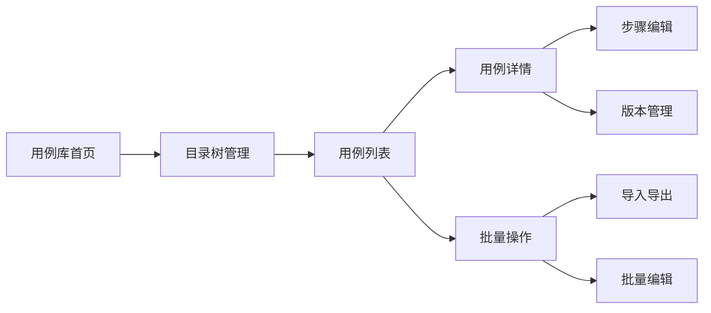
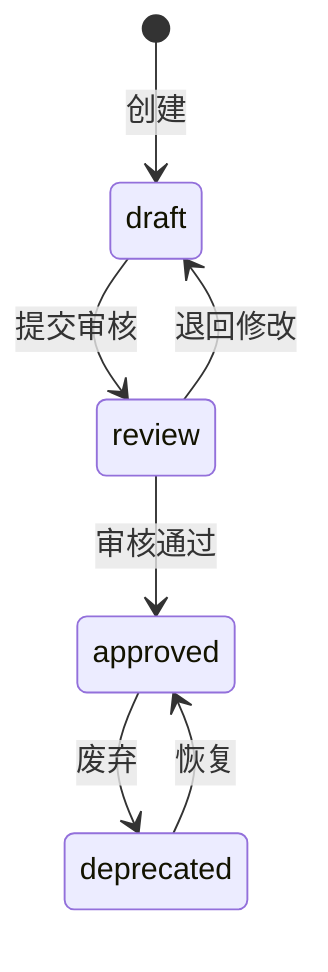
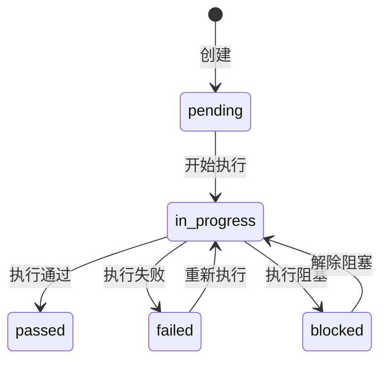

# 测试管理插件项目知识库 V2.0

> 📚 本文档是Proxima测试管理插件的完整技术知识库，包含架构设计、功能实现、最佳实践和故障排查等全方位内容。

## 📋 项目概述

**项目名称**: Proxima测试管理插件 (Test Manager Plugin)  
**当前版本**: 4.38.292  
**项目类型**: Proxima平台企业级插件  
**开发语言**: TypeScript + React  
**构建工具**: Webpack 5  
**代码规模**: 200+ 组件，50+ 页面，200+ API接口

### 快速开始

```bash
# 克隆项目
git clone <repository-url>

# 安装依赖
yarn install

# 启动开发服务器
yarn dev

# 构建生产版本
yarn build

# 打包插件
sh ./build-app.sh

# 部署插件
yarn deploy
```

## 🏗️ 技术架构

### 核心技术栈

#### 前端框架
- **React 17.0.2** - 主UI框架
- **TypeScript 4.4.3** - 类型安全保障
- **Ant Design 5.7.3** - UI组件库
- **Less 4.1.3** - CSS预处理器

#### 状态管理
- **@tanstack/react-query 4.29.7** - 服务端状态管理
- **Jotai 2.1.1** - 原子化状态管理
- **Context API** - 组件间状态共享
- **EventBus** - 事件驱动通信

#### 专业功能库
- **react-beautiful-dnd 13.1.0** - 拖拽功能实现
- **echarts 5.3.3** - 数据可视化图表
- **xmind 2.2.30** - XMind文件处理
- **docx 8.2.0** - Word文档生成
- **test-manager-minder** - 自研脑图组件
- **react-virtuoso 4.2.1** - 虚拟滚动优化

#### 企业集成
- **@giteeteam/plugin-sdk 0.9.2** - 插件开发SDK
- **@projectproxima/proxima-sdk-js 0.4.4** - Proxima平台SDK
- **Parse 3.4.1** - 数据持久化层

### 架构设计模式

#### 1. 微前端架构
```typescript
// 路由级代码分割示例
const Repository = React.lazy(() => import('./pages/repository'));
const Plan = React.lazy(() => import('./pages/plan'));
const Report = React.lazy(() => import('./pages/report'));

// 独立组件包加载
const FieldComponents = React.lazy(() => import('../fields'));
const ChartComponents = React.lazy(() => import('../chart'));
```

#### 2. 插件化架构
- 触发器系统 - 200+ WebTrigger函数
- 事件驱动机制
- VM沙盒隔离运行环境
- 可扩展的模块系统

#### 3. 多租户架构
- Workspace级别数据隔离
- 用户权限控制
- 配置的层级继承

## 🎯 核心功能模块详解

### 1. 测试用例库 (Repository)

#### 业务流程图


#### 核心功能实现

**1.1 虚拟树优化大数据渲染**
```typescript
// pages/repository/FolderTree/VirtualTree.tsx
const VirtualTree: React.FC<VirtualTreeProps> = ({ treeData, height = 600 }) => {
  const [expandedKeys, setExpandedKeys] = useState<string[]>([]);
  const [visibleRange, setVisibleRange] = useState({ start: 0, end: 50 });
  
  // 计算所有展开的节点
  const allExpandedNodes = useMemo(() => {
    const nodes: TreeNode[] = [];
    const traverse = (data: TreeNode[], level = 0) => {
      data.forEach(node => {
        nodes.push({ ...node, level });
        if (expandedKeys.includes(node.key) && node.children) {
          traverse(node.children, level + 1);
        }
      });
    };
    traverse(treeData);
    return nodes;
  }, [treeData, expandedKeys]);

  // 虚拟滚动：只渲染可见节点
  const visibleNodes = useMemo(() => {
    return allExpandedNodes.slice(visibleRange.start, visibleRange.end);
  }, [allExpandedNodes, visibleRange]);

  // 滚动事件处理
  const handleScroll = useCallback((e: React.UIEvent<HTMLDivElement>) => {
    const scrollTop = e.currentTarget.scrollTop;
    const itemHeight = 28; // 每个节点的高度
    const start = Math.floor(scrollTop / itemHeight);
    const end = start + Math.ceil(height / itemHeight) + 10; // 预渲染10个
    setVisibleRange({ start, end });
  }, [height]);

  return (
    <div className="virtual-tree" style={{ height }} onScroll={handleScroll}>
      <div style={{ height: allExpandedNodes.length * 28 }}>
        {visibleNodes.map(node => (
          <TreeNode key={node.key} {...node} />
        ))}
      </div>
    </div>
  );
};
```

**1.2 拖拽重组实现**
```typescript
// 使用react-beautiful-dnd实现拖拽
const handleDragEnd = (result: DropResult) => {
  if (!result.destination) return;
  
  const { source, destination, draggableId } = result;
  
  // 不同目录间移动
  if (source.droppableId !== destination.droppableId) {
    moveTestCase({
      caseId: draggableId,
      fromFolder: source.droppableId,
      toFolder: destination.droppableId,
      index: destination.index
    });
  } 
  // 同目录内排序
  else {
    reorderTestCase({
      folderId: source.droppableId,
      fromIndex: source.index,
      toIndex: destination.index
    });
  }
};
```

**1.3 批量导入Excel**
```typescript
// 导入Excel的完整流程
const importExcel = async (file: File) => {
  // 1. 解析Excel文件
  const workbook = XLSX.read(await file.arrayBuffer());
  const sheet = workbook.Sheets[workbook.SheetNames[0]];
  const data = XLSX.utils.sheet_to_json(sheet);
  
  // 2. 数据验证
  const validation = await validateImportData(data);
  if (validation.errors.length > 0) {
    showValidationErrors(validation.errors);
    return;
  }
  
  // 3. 批量创建用例
  const batchResult = await batchCreateTestCases(data.map(row => ({
    name: row['用例名称'],
    repository: currentFolder,
    detail: {
      precondition: row['前置条件'],
      steps: parseSteps(row['测试步骤'])
    },
    priority: row['优先级'],
    assignee: row['负责人']
  })));
  
  // 4. 显示导入结果
  notification.success({
    message: `成功导入 ${batchResult.success} 条用例`,
    description: batchResult.failed > 0 ? 
      `失败 ${batchResult.failed} 条` : undefined
  });
};
```

### 2. 测试计划 (Plan)

#### 执行流程控制
```typescript
// pages/plan/TestEntityList/index.tsx
const TestEntityList: React.FC = () => {
  const { planId, workspaceKey } = useContext(PlanContext);
  
  // 三层数据结构
  const { testPlan } = useTestPlan(planId);
  const { executionTasks } = useExecutionTasks(planId);
  const { testRuns } = useTestRuns(executionTasks);
  
  // 批量创建执行任务
  const createExecutionTasks = async () => {
    const selectedCases = getSelectedCases();
    
    const tasks = await batchCreateExecutionTasks({
      planId,
      testCases: selectedCases,
      assignees: getAssignees(),
      splitStrategy: 'BY_MODULE' // 按模块分配
    });
    
    // 自动生成执行记录
    await generateTestRuns(tasks);
  };
  
  // 进度统计
  const progress = useMemo(() => {
    const total = testRuns.length;
    const passed = testRuns.filter(r => r.status === 'passed').length;
    const failed = testRuns.filter(r => r.status === 'failed').length;
    const pending = testRuns.filter(r => r.status === 'pending').length;
    
    return {
      total,
      passed,
      failed,
      pending,
      passRate: total > 0 ? (passed / total * 100).toFixed(2) : 0
    };
  }, [testRuns]);
  
  return (
    <div className="test-entity-list">
      <StatusProcessBar {...progress} />
      <BusinessTable 
        dataSource={testRuns}
        columns={columns}
        rowSelection={rowSelection}
      />
    </div>
  );
};
```

### 3. 测试执行 (Execution)

#### 完整执行界面实现
```typescript
// components/business/TestRunModal/TestRunV2.tsx
const TestRunV2: React.FC<TestRunProps> = ({ testRunId, onClose }) => {
  const [activeTab, setActiveTab] = useState('step');
  const { testRun, updateTestRun } = useTestRun(testRunId);
  const { canExecute } = useTestRunAuth(testRun);
  
  // 执行步骤
  const executeStep = async (stepId: string, result: 'pass' | 'fail') => {
    await updateTestRunStep(testRunId, stepId, { 
      status: result,
      actualResult: getActualResult(),
      executedAt: new Date(),
      executor: currentUser
    });
    
    // 自动切换到下一步
    if (result === 'pass') {
      focusNextStep(stepId);
    }
  };
  
  // 创建缺陷
  const createDefect = async () => {
    const defect = await createDefectFromTestRun({
      testRunId,
      title: `${testRun.testCase.name} 执行失败`,
      description: generateDefectDescription(),
      attachments: getCurrentAttachments()
    });
    
    // 关联缺陷到执行记录
    await linkDefectToTestRun(testRunId, defect.id);
    
    // 更新执行状态为失败
    updateTestRun({ status: 'failed' });
  };
  
  // 快捷键支持
  useKeyboardShortcuts({
    'Alt+P': () => executeStep(currentStepId, 'pass'),
    'Alt+F': () => executeStep(currentStepId, 'fail'),
    'Alt+N': () => switchToNextTestRun(),
    'Alt+D': () => openDefectModal()
  });
  
  const tabs = [
    {
      key: 'step',
      label: '测试步骤',
      children: <TestStep steps={testRun.testCase.detail.steps} />
    },
    {
      key: 'result',
      label: '执行结果',
      children: <ExecutionEditor value={testRun.result} />
    },
    {
      key: 'defect',
      label: `缺陷 (${testRun.defects?.length || 0})`,
      children: <DefectList defects={testRun.defects} />
    },
    {
      key: 'attachment',
      label: '附件',
      children: <AttachmentUpload testRunId={testRunId} />
    }
  ];
  
  return (
    <Modal
      title={`执行测试用例: ${testRun.testCase.name}`}
      visible
      onCancel={onClose}
      width={1200}
      footer={<ExecutionFooter testRun={testRun} />}
    >
      <Tabs activeKey={activeTab} onChange={setActiveTab} items={tabs} />
    </Modal>
  );
};
```

### 4. 测试报告 (Report)

#### 报告生成流程
```typescript
// pages/report/Model/createReportV2Model.tsx
const createReportV2 = async (config: ReportConfig) => {
  // 1. 收集数据
  const reportData = await collectReportData({
    planIds: config.planIds,
    dateRange: config.dateRange,
    includeModules: config.modules
  });
  
  // 2. 应用模板
  const template = await loadReportTemplate(config.templateId);
  const htmlContent = await renderTemplate(template, reportData);
  
  // 3. 生成不同格式
  const formats = {
    html: htmlContent,
    word: await generateWordDocument(htmlContent, template.wordTemplate),
    pdf: await generatePDF(htmlContent)
  };
  
  // 4. 保存报告
  const report = await saveReport({
    name: config.name,
    content: formats.html,
    attachments: {
      word: formats.word,
      pdf: formats.pdf
    },
    workspace: currentWorkspace,
    createdBy: currentUser
  });
  
  // 5. 发送报告（如果需要）
  if (config.sendEmail) {
    await sendReportByEmail({
      reportId: report.id,
      recipients: config.emailRecipients,
      format: config.emailFormat
    });
  }
  
  return report;
};
```

## 🔧 最佳实践

### 性能优化最佳实践

#### 1. 大数据列表优化
```typescript
// 使用虚拟滚动处理万级数据
import { Virtuoso } from 'react-virtuoso';

const LargeList: React.FC = ({ data }) => {
  return (
    <Virtuoso
      style={{ height: '600px' }}
      data={data}
      itemContent={(index, item) => (
        <ListItem key={item.id} data={item} />
      )}
      overscan={10} // 预渲染10个项目
      increaseViewportBy={{ top: 100, bottom: 100 }} // 扩展视口
    />
  );
};
```

#### 2. 请求优化
```typescript
// 使用React Query进行请求去重和缓存
const useTestCases = (repositoryId: string) => {
  return useQuery(
    ['testCases', repositoryId],
    () => fetchTestCases(repositoryId),
    {
      staleTime: 5 * 60 * 1000, // 5分钟内数据保持新鲜
      cacheTime: 10 * 60 * 1000, // 10分钟缓存
      refetchOnWindowFocus: false, // 窗口聚焦时不重新请求
      refetchOnMount: false, // 组件挂载时不重新请求
    }
  );
};

// 预取数据
const prefetchTestCases = async (repositoryIds: string[]) => {
  await Promise.all(
    repositoryIds.map(id => 
      queryClient.prefetchQuery(['testCases', id], () => fetchTestCases(id))
    )
  );
};
```

#### 3. 组件优化
```typescript
// 使用memo和useMemo优化渲染
const TestCaseItem = React.memo<TestCaseItemProps>(({ testCase, onSelect }) => {
  // 只在testCase.status变化时重新计算
  const statusIcon = useMemo(() => {
    return getStatusIcon(testCase.status);
  }, [testCase.status]);
  
  // 使用useCallback避免函数重新创建
  const handleClick = useCallback(() => {
    onSelect(testCase.id);
  }, [testCase.id, onSelect]);
  
  return (
    <div onClick={handleClick}>
      {statusIcon}
      {testCase.name}
    </div>
  );
}, (prevProps, nextProps) => {
  // 自定义比较函数，只比较必要的属性
  return (
    prevProps.testCase.id === nextProps.testCase.id &&
    prevProps.testCase.status === nextProps.testCase.status &&
    prevProps.testCase.name === nextProps.testCase.name
  );
});
```

### 代码组织最佳实践

#### 1. 自定义Hook封装
```typescript
// lib/hooks/useTestExecution.ts
export const useTestExecution = (testRunId: string) => {
  const [status, setStatus] = useState<ExecutionStatus>('pending');
  const [currentStep, setCurrentStep] = useState(0);
  const { testRun, updateTestRun } = useTestRun(testRunId);
  
  const executeStep = useCallback(async (stepIndex: number, result: StepResult) => {
    const step = testRun.steps[stepIndex];
    
    // 更新步骤结果
    await updateTestRunStep(testRunId, step.id, result);
    
    // 计算整体状态
    const allStepsCompleted = testRun.steps.every(s => s.status !== 'pending');
    const hasFailedStep = testRun.steps.some(s => s.status === 'failed');
    
    if (allStepsCompleted) {
      setStatus(hasFailedStep ? 'failed' : 'passed');
    }
    
    // 自动跳转下一步
    if (result.status === 'passed' && stepIndex < testRun.steps.length - 1) {
      setCurrentStep(stepIndex + 1);
    }
  }, [testRun, testRunId]);
  
  const skipToStep = useCallback((stepIndex: number) => {
    setCurrentStep(stepIndex);
  }, []);
  
  return {
    status,
    currentStep,
    executeStep,
    skipToStep,
    testRun
  };
};
```

#### 2. 类型定义规范
```typescript
// lib/types/Test.ts
export interface TestCase extends BaseEntity {
  name: string;
  repository: string;
  detail: TestDetail;
  priority: Priority;
  status: CaseStatus;
  tags?: string[];
  customFields?: CustomField[];
}

export interface TestDetail {
  precondition?: string;
  steps: TestStep[];
  postcondition?: string;
}

export interface TestStep {
  id: string;
  order: number;
  action: string;
  data?: string;
  expectedResult: string;
  actualResult?: string;
  status?: StepStatus;
  attachments?: Attachment[];
}

export type Priority = 'P0' | 'P1' | 'P2' | 'P3';
export type CaseStatus = 'draft' | 'review' | 'approved' | 'deprecated';
export type StepStatus = 'pending' | 'passed' | 'failed' | 'blocked' | 'skipped';
```

## 🐛 故障排查指南

### 常见问题及解决方案

#### 1. 虚拟树渲染性能问题
**问题表现**: 大量节点展开时页面卡顿
**排查步骤**:
```typescript
// 1. 检查展开节点数量
console.log('Expanded nodes:', allExpandedNodes.length);

// 2. 检查渲染的实际节点数
console.log('Visible nodes:', visibleNodes.length);

// 3. 性能分析
performance.mark('render-start');
// 渲染代码
performance.mark('render-end');
performance.measure('render', 'render-start', 'render-end');
const measure = performance.getEntriesByName('render')[0];
console.log('Render time:', measure.duration);
```

**解决方案**:
```typescript
// 限制最大展开层级
const MAX_EXPAND_LEVEL = 3;

// 懒加载子节点
const loadChildren = async (nodeKey: string) => {
  const children = await fetchChildren(nodeKey);
  updateTreeData(nodeKey, children);
};
```

#### 2. 批量操作超时
**问题表现**: 批量操作大量数据时请求超时
**解决方案**:
```typescript
// 分批处理
const batchProcess = async (items: any[], batchSize = 100) => {
  const results = [];
  for (let i = 0; i < items.length; i += batchSize) {
    const batch = items.slice(i, i + batchSize);
    const result = await processBatch(batch);
    results.push(...result);
    
    // 显示进度
    const progress = Math.round((i + batch.length) / items.length * 100);
    updateProgress(progress);
  }
  return results;
};
```

#### 3. 内存泄漏问题
**排查工具**:
```typescript
// 监控内存使用
if (process.env.NODE_ENV === 'development') {
  setInterval(() => {
    if (performance.memory) {
      console.log('Memory usage:', {
        used: (performance.memory.usedJSHeapSize / 1048576).toFixed(2) + ' MB',
        total: (performance.memory.totalJSHeapSize / 1048576).toFixed(2) + ' MB',
        limit: (performance.memory.jsHeapSizeLimit / 1048576).toFixed(2) + ' MB'
      });
    }
  }, 10000);
}
```

**常见原因及修复**:
```typescript
// 1. 未清理的事件监听器
useEffect(() => {
  const handler = (e) => { /* ... */ };
  window.addEventListener('resize', handler);
  
  // 必须清理
  return () => {
    window.removeEventListener('resize', handler);
  };
}, []);

// 2. 未取消的定时器
useEffect(() => {
  const timer = setInterval(() => { /* ... */ }, 1000);
  
  // 必须清理
  return () => {
    clearInterval(timer);
  };
}, []);

// 3. 未取消的请求
useEffect(() => {
  const controller = new AbortController();
  
  fetch('/api/data', { signal: controller.signal })
    .then(res => res.json())
    .then(data => setData(data));
  
  // 必须取消
  return () => {
    controller.abort();
  };
}, []);
```

### 调试技巧

#### 1. React DevTools调试
```typescript
// 在组件中添加调试信息
const MyComponent: React.FC = () => {
  // 在React DevTools中显示
  React.useDebugValue('MyComponent Debug Info');
  
  const [state, setState] = useState(initialState);
  React.useDebugValue(state, state => `State: ${JSON.stringify(state)}`);
  
  return <div>{/* ... */}</div>;
};
```

#### 2. 网络请求调试
```typescript
// 请求拦截器
axios.interceptors.request.use(config => {
  console.group(`🚀 [${config.method?.toUpperCase()}] ${config.url}`);
  console.log('Headers:', config.headers);
  console.log('Params:', config.params);
  console.log('Data:', config.data);
  console.groupEnd();
  return config;
});

// 响应拦截器
axios.interceptors.response.use(
  response => {
    console.group(`✅ [${response.status}] ${response.config.url}`);
    console.log('Data:', response.data);
    console.groupEnd();
    return response;
  },
  error => {
    console.group(`❌ [${error.response?.status}] ${error.config?.url}`);
    console.error('Error:', error.message);
    console.log('Response:', error.response?.data);
    console.groupEnd();
    return Promise.reject(error);
  }
);
```

## 📊 API文档

### 核心API接口详解

#### 1. 测试用例API

**创建测试用例**
```typescript
POST /api/test-cases

// 请求体
{
  "name": "用户登录测试",
  "repository": "folder_123",
  "detail": {
    "precondition": "用户未登录",
    "steps": [
      {
        "action": "输入用户名",
        "data": "testuser",
        "expectedResult": "用户名输入框显示输入内容"
      },
      {
        "action": "输入密码",
        "data": "password123",
        "expectedResult": "密码输入框显示掩码"
      },
      {
        "action": "点击登录按钮",
        "expectedResult": "跳转到首页"
      }
    ]
  },
  "priority": "P1",
  "tags": ["登录", "核心功能"]
}

// 响应
{
  "status": "success",
  "data": {
    "id": "case_456",
    "name": "用户登录测试",
    "createdAt": "2024-01-01T10:00:00Z",
    "createdBy": {
      "id": "user_789",
      "name": "张三"
    }
  }
}
```

**批量查询测试用例**
```typescript
POST /api/batch/query-test-cases

// 请求体
{
  "query": {
    "repository": {
      "operator": "in",
      "value": ["folder_123", "folder_456"]
    },
    "status": "approved",
    "priority": {
      "operator": "in",
      "value": ["P0", "P1"]
    }
  },
  "pagination": {
    "offset": 0,
    "limit": 20
  },
  "sort": {
    "field": "createdAt",
    "order": "desc"
  }
}

// 响应
{
  "status": "success",
  "data": {
    "items": [...],
    "total": 150,
    "offset": 0,
    "limit": 20
  }
}
```

#### 2. 测试执行API

**创建测试执行**
```typescript
POST /api/test-runs

// 请求体
{
  "testCaseId": "case_456",
  "planId": "plan_789",
  "assignee": "user_123",
  "deadline": "2024-01-10T00:00:00Z"
}

// 响应
{
  "status": "success",
  "data": {
    "id": "run_012",
    "testCase": {...},
    "status": "pending",
    "createdAt": "2024-01-01T10:00:00Z"
  }
}
```

**更新执行结果**
```typescript
PUT /api/test-runs/{runId}/result

// 请求体
{
  "status": "failed",
  "actualResult": "登录失败，提示用户名或密码错误",
  "stepResults": [
    {
      "stepId": "step_1",
      "status": "passed"
    },
    {
      "stepId": "step_2",
      "status": "passed"
    },
    {
      "stepId": "step_3",
      "status": "failed",
      "actualResult": "提示用户名或密码错误"
    }
  ],
  "defectIds": ["defect_123"],
  "attachments": ["file_456", "file_789"]
}
```

### WebTrigger API列表

基于manifest.yml的完整API清单：

#### 查询类API
| API Key | 功能描述 | 请求方式 |
|---------|---------|----------|
| api-query-test-entity | 查询测试实体 | POST |
| api-query-linked-test-entity | 查询关联实体 | POST |
| api-query-case-by-status | 按状态查询用例 | POST |
| api-query-run-records | 查询执行记录 | POST |
| api-query-batch-result | 查询批量操作结果 | GET |

#### 批量操作API
| API Key | 功能描述 | 请求方式 |
|---------|---------|----------|
| api-batch-delete-v2 | 批量删除(V2) | POST |
| api-batch-update-items-v2 | 批量更新项目 | POST |
| api-batch-create-test-run | 批量创建执行 | POST |
| api-batch-create-test-case | 批量创建用例 | POST |
| api-batch-create-versions | 批量创建版本 | POST |

#### 统计分析API
| API Key | 功能描述 | 请求方式 |
|---------|---------|----------|
| report-stats | 报告统计数据 | POST |
| api-stats-test-plan | 测试计划统计 | POST |
| api-stats-execution | 执行情况统计 | POST |

## 📈 数据字典

### 核心数据表结构

#### TestCase表
```sql
CREATE TABLE TestCase (
  objectId VARCHAR(32) PRIMARY KEY,
  name VARCHAR(255) NOT NULL,
  repository VARCHAR(32),
  detail JSON,
  priority ENUM('P0', 'P1', 'P2', 'P3'),
  status ENUM('draft', 'review', 'approved', 'deprecated'),
  assignee VARCHAR(32),
  tags JSON,
  customFields JSON,
  sortIndex INT,
  createdAt TIMESTAMP,
  updatedAt TIMESTAMP,
  createdBy VARCHAR(32),
  workspace VARCHAR(32),
  INDEX idx_repository (repository),
  INDEX idx_status (status),
  INDEX idx_assignee (assignee)
);
```

#### TestPlan表
```sql
CREATE TABLE TestPlan (
  objectId VARCHAR(32) PRIMARY KEY,
  name VARCHAR(255) NOT NULL,
  description TEXT,
  startDate DATE,
  endDate DATE,
  status ENUM('draft', 'in_progress', 'completed', 'cancelled'),
  owner VARCHAR(32),
  workspace VARCHAR(32),
  createdAt TIMESTAMP,
  updatedAt TIMESTAMP,
  INDEX idx_status (status),
  INDEX idx_owner (owner)
);
```

#### TestRun表
```sql
CREATE TABLE TestRun (
  objectId VARCHAR(32) PRIMARY KEY,
  testCaseId VARCHAR(32) NOT NULL,
  planId VARCHAR(32),
  executionTaskId VARCHAR(32),
  executor VARCHAR(32),
  status ENUM('pending', 'in_progress', 'passed', 'failed', 'blocked'),
  result JSON,
  defectIds JSON,
  attachments JSON,
  executedAt TIMESTAMP,
  createdAt TIMESTAMP,
  updatedAt TIMESTAMP,
  FOREIGN KEY (testCaseId) REFERENCES TestCase(objectId),
  FOREIGN KEY (planId) REFERENCES TestPlan(objectId),
  INDEX idx_status (status),
  INDEX idx_executor (executor)
);
```

### 状态机定义

#### 测试用例状态流转


#### 测试执行状态流转


## 🔄 版本演进历史

### 主要版本里程碑

#### v4.38.x系列 (当前版本)
- **4.38.292** (2024-01) - 当前稳定版本
  - ✅ 虚拟树性能优化
  - ✅ 拖拽功能增强
  - ✅ 批量操作优化
  
- **4.38.250** (2023-12)
  - ✅ 新增XMind导入功能
  - ✅ 报告模板系统重构
  
- **4.38.200** (2023-11)
  - ✅ React Query集成
  - ✅ 性能大幅优化

#### v4.37.x系列
- 基础功能完善
- UI/UX改进
- 初版发布

### 升级指南

#### 从4.37.x升级到4.38.x

**1. 依赖更新**
```json
{
  "dependencies": {
    "react": "^17.0.2",  // 从16.x升级
    "@tanstack/react-query": "^4.29.7", // 新增
    "antd": "^5.7.3" // 从4.x升级
  }
}
```

**2. API变更**
```typescript
// 旧版本
const testCases = await getTestCases(repository);

// 新版本 - 使用React Query
const { data: testCases } = useQuery(
  ['testCases', repository],
  () => getTestCases(repository)
);
```

**3. 数据库迁移**
```sql
-- 添加虚拟树索引
ALTER TABLE TestCase ADD INDEX idx_sortIndex (sortIndex);

-- 添加自定义字段支持
ALTER TABLE TestCase ADD COLUMN customFields JSON;
```

**4. 配置迁移**
```typescript
// 旧配置
{
  "testManager": {
    "enableMinder": true
  }
}

// 新配置
{
  "testManager": {
    "features": {
      "minder": true,
      "virtualTree": true,
      "batchOperation": true
    }
  }
}
```

## 🚀 部署和运维

### 生产环境部署

#### 1. 环境准备
```bash
# Node.js版本要求
node --version  # >= 14.x

# 安装依赖
yarn install --production

# 环境变量配置
export NODE_ENV=production
export API_BASE_URL=https://api.proxima.com
export WORKSPACE_KEY=your_workspace_key
```

#### 2. 构建优化
```javascript
// webpack.config.prod.js
module.exports = {
  mode: 'production',
  optimization: {
    minimize: true,
    splitChunks: {
      chunks: 'all',
      cacheGroups: {
        vendor: {
          test: /[\\/]node_modules[\\/]/,
          name: 'vendors',
          priority: 10
        },
        common: {
          minChunks: 2,
          priority: 5,
          reuseExistingChunk: true
        }
      }
    }
  },
  performance: {
    maxEntrypointSize: 512000,
    maxAssetSize: 512000
  }
};
```

#### 3. 部署脚本
```bash
#!/bin/bash
# deploy.sh

# 构建
echo "Building application..."
yarn build

# 打包插件
echo "Packaging plugin..."
giteeteam-apps build --prod

# 上传到服务器
echo "Uploading to server..."
scp -r dist/* user@server:/var/www/test-manager/

# 重启服务
echo "Restarting services..."
ssh user@server "pm2 restart test-manager"

echo "Deployment completed!"
```

### 监控和告警

#### 1. 性能监控
```typescript
// 前端性能监控
if (window.performance) {
  window.addEventListener('load', () => {
    const perfData = window.performance.timing;
    const pageLoadTime = perfData.loadEventEnd - perfData.navigationStart;
    const connectTime = perfData.responseEnd - perfData.requestStart;
    const renderTime = perfData.domComplete - perfData.domLoading;
    
    // 上报性能数据
    reportPerformance({
      pageLoadTime,
      connectTime,
      renderTime,
      userAgent: navigator.userAgent
    });
  });
}
```

#### 2. 错误监控
```typescript
// 全局错误捕获
window.addEventListener('error', (event) => {
  reportError({
    message: event.message,
    source: event.filename,
    lineno: event.lineno,
    colno: event.colno,
    error: event.error?.stack
  });
});

// Promise错误捕获
window.addEventListener('unhandledrejection', (event) => {
  reportError({
    type: 'unhandledrejection',
    reason: event.reason,
    promise: event.promise
  });
});
```

#### 3. 用户行为监控
```typescript
// 关键操作埋点
const trackEvent = (category: string, action: string, label?: string) => {
  if (window.gtag) {
    window.gtag('event', action, {
      event_category: category,
      event_label: label
    });
  }
};

// 使用示例
trackEvent('TestCase', 'Create', 'FromTemplate');
trackEvent('TestPlan', 'Execute', 'BatchExecution');
```

## 🔐 安全最佳实践

### 1. 输入验证
```typescript
// 前端验证
const validateTestCase = (data: any): ValidationResult => {
  const errors: string[] = [];
  
  // XSS防护
  if (containsHtmlTags(data.name)) {
    errors.push('用例名称不能包含HTML标签');
  }
  
  // SQL注入防护
  if (containsSqlKeywords(data.name)) {
    errors.push('用例名称包含非法字符');
  }
  
  // 长度限制
  if (data.name.length > 255) {
    errors.push('用例名称不能超过255个字符');
  }
  
  return {
    valid: errors.length === 0,
    errors
  };
};
```

### 2. 权限控制
```typescript
// 细粒度权限检查
const checkPermission = (action: string, resource: any): boolean => {
  const user = getCurrentUser();
  const permissions = getUserPermissions(user);
  
  // 检查操作权限
  if (!permissions.includes(action)) {
    return false;
  }
  
  // 检查资源权限
  if (resource.workspace !== user.workspace) {
    return false;
  }
  
  // 检查数据权限
  if (action === 'execute' && resource.assignee !== user.id) {
    return false;
  }
  
  return true;
};
```

### 3. 数据加密
```typescript
// 敏感数据加密
import CryptoJS from 'crypto-js';

const encryptSensitiveData = (data: any): string => {
  const secretKey = process.env.ENCRYPTION_KEY;
  return CryptoJS.AES.encrypt(JSON.stringify(data), secretKey).toString();
};

const decryptSensitiveData = (encryptedData: string): any => {
  const secretKey = process.env.ENCRYPTION_KEY;
  const bytes = CryptoJS.AES.decrypt(encryptedData, secretKey);
  return JSON.parse(bytes.toString(CryptoJS.enc.Utf8));
};
```

## 📚 开发资源

### 相关链接
- [Proxima平台文档](https://docs.proxima.com)
- [React官方文档](https://react.dev)
- [TypeScript手册](https://www.typescriptlang.org/docs/)
- [Ant Design组件库](https://ant.design)

### 开发工具推荐
- **VS Code插件**
  - ESLint
  - Prettier
  - TypeScript Hero
  - React Snippets
  
- **Chrome扩展**
  - React Developer Tools
  - Redux DevTools
  - Network Inspector

### 团队规范
- [代码规范文档](./docs/CODE_STYLE.md)
- [Git提交规范](./docs/GIT_COMMIT.md)
- [PR审查清单](./docs/PR_CHECKLIST.md)
- [发布流程](./docs/RELEASE.md)

---

## 📞 技术支持

**维护团队**: Proxima开发团队  
**技术栈**: React + TypeScript + Ant Design + Parse  
**更新频率**: 每周版本发布  
**支持渠道**: 
- 内部Wiki: https://wiki.proxima.com/test-manager
- 问题跟踪: https://jira.proxima.com/projects/TM
- 技术讨论: #test-manager (Slack)

---

*文档版本: v2.0*  
*最后更新: 2024-01-15*  
*本文档基于项目代码深度分析生成，包含完整的技术细节、实战经验和最佳实践。*