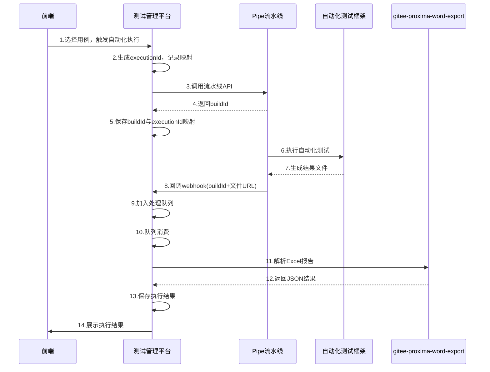

# 自动化用例流水线执行 - 分步技术方案

> 本文档为技术实现方案，对应的任务管理请查看 [TodoList](./automation-pipeline-todolist.md)

## 一、整体流程概述



## 二、技术方案详细设计

### T1. 设计数据模型和表结构
> 对应TodoList: T1

#### AutomationExecutionRecord（自动化执行记录表）
```typescript
{
  executionId: string;          // 本次执行ID（内部生成，格式：exec_20240115_143052_8f3a）
  buildId: string;              // pipe返回的buildId（用于关联回调）
  testExecutionIds: string[];   // 选中的测试执行ID列表
  mavenVersion: string;         // Maven版本
  jdkVersion: string;           // JDK版本
  status: string;               // 状态：pending → running → parsing → completed/failed
  triggerTime: Date;            // 触发时间
  completeTime: Date;           // 完成时间
  pipeJumpUrl: string;          // 流水线跳转URL
  pipeLogUrl: string;           // 流水线日志URL
  reportUrl: string;            // 测试报告URL
  reportLogUrl: string;         // 报告执行日志URL
  triggerUser: string;          // 触发用户
  workspaceKey: string;         // 工作空间key
  errorMessage: string;         // 错误信息
  // 执行统计
  totalCount: number;           // 总执行数
  successCount: number;         // 成功数
  failedCount: number;          // 失败数
  skippedCount: number;         // 跳过数
}
```

#### 测试执行（Test Execution）自定义字段
```yaml
# 在manifest.yml中声明自定义字段
modules:
  proxima:CustomField:
    - key: automation_status
      name: 自动化执行状态
      description: 自动化测试执行状态，执行中时不允许重复触发
      fieldType: Dropdown
      data:
        customData:
          - label: 待执行
            value: pending
          - label: 执行中
            value: running
          - label: 成功
            value: success
          - label: 失败
            value: failed
      undeletable: true
      locked: false
```

#### 执行控制逻辑（简化版）
```typescript
// 执行前检查
async function canExecuteAutomation(testExecutionIds: string[]): Promise<{
  canExecute: boolean;
  blockedExecutions: string[];
}> {
  const blockedExecutions = [];
  
  for (const execId of testExecutionIds) {
    const execution = await getTestExecution(execId);
    
    // 检查是否正在执行中
    if (execution.customFields?.automation_status === 'running') {
      blockedExecutions.push(execId);
    }
  }
  
  return {
    canExecute: blockedExecutions.length === 0,
    blockedExecutions
  };
}

// 触发执行时
async function triggerAutomation(testExecutionIds: string[]) {
  // 1. 检查是否可以执行
  const check = await canExecuteAutomation(testExecutionIds);
  if (!check.canExecute) {
    throw new Error(`以下测试执行正在进行中，请稍后再试: ${check.blockedExecutions.join(', ')}`);
  }
  
  // 2. 更新状态为执行中
  await updateTestExecutionStatus(testExecutionIds, 'running');
  
  // 3. 调用Pipe流水线
  const response = await callPipeAPI({...});
  
  // 4. 创建执行记录
  await createExecutionRecord({...});
}

// 执行完成回调处理
async function handleExecutionCallback(buildId: string, results: any) {
  const record = await findExecutionByBuildId(buildId);
  
  // 批量更新测试执行状态
  for (const execId of record.testExecutionIds) {
    const testResult = results.find(r => r.testId === execId);
    const status = testResult?.result === 'SUCCESS' ? 'success' : 'failed';
    
    await updateTestExecutionStatus([execId], status);
  }
}

// 更新测试执行状态的通用方法
async function updateTestExecutionStatus(execIds: string[], status: string) {
  for (const execId of execIds) {
    await updateTestExecutionCustomField(execId, 'automation_status', status);
  }
}
```

#### PipeCallbackQueue（Pipe回调队列表）
```typescript
{
  queueId: string;              // 队列记录ID
  buildId: string;              // pipe的buildId
  callbackData: string;         // 回调数据JSON
  status: string;               // 处理状态：pending/processing/completed/failed
  retryCount: number;           // 重试次数
  createdAt: Date;              // 创建时间
  processedAt: Date;            // 处理时间
  errorMessage: string;         // 错误信息
}
```

### T2. 实现前端触发按钮和参数选择界面
> 对应TodoList: T2

**功能：**
- 在测试执行列表页面添加"自动化执行"按钮（支持单个触发）
- 在批量操作工具栏添加"批量执行自动化"按钮（支持多选批量触发）
- 弹窗选择Maven版本和JDK版本参数
- 显示执行状态和进度
- 执行前检查：执行中状态的用例不允许重复触发

**实现要点：**
```typescript
// 执行参数接口
interface ExecuteParams {
  testExecutionIds: string[];
  mavenVersion: string;
  jdkVersion: string;
}

// 前端组件接口
interface AutomationExecuteModalProps {
  testExecutionIds: string[];  // 选中的测试执行ID列表
  onExecute: (params: ExecuteParams) => Promise<void>;
  onCancel: () => void;
  visible: boolean;
}

// 参数选择弹窗组件
const AutomationExecuteModal: React.FC<AutomationExecuteModalProps> = ({ 
  testExecutionIds, 
  onExecute, 
  onCancel, 
  visible 
}) => {
  const [mavenVersion, setMavenVersion] = useState('3.6.3');
  const [jdkVersion, setJdkVersion] = useState('1.8');
  const [loading, setLoading] = useState(false);
  
  const mavenOptions = ['3.6.3', '3.8.1', '3.9.0'];
  const jdkOptions = ['1.8', '11', '17'];
  
  const handleExecute = async () => {
    setLoading(true);
    try {
      await onExecute({
        testExecutionIds,
        mavenVersion,
        jdkVersion
      });
      onCancel(); // 执行成功后关闭弹窗
    } catch (error) {
      console.error('执行失败:', error);
      // 显示错误提示
    } finally {
      setLoading(false);
    }
  };
  
  return (
    <Modal title="自动化执行参数配置" visible={visible} onCancel={onCancel}>
      <div>
        <p>将执行 {testExecutionIds.length} 个测试用例</p>
        <Select 
          label="Maven版本" 
          value={mavenVersion} 
          options={mavenOptions}
          onChange={setMavenVersion} 
        />
        <Select 
          label="JDK版本" 
          value={jdkVersion} 
          options={jdkOptions}
          onChange={setJdkVersion} 
        />
        <Button onClick={handleExecute} loading={loading}>
          开始执行
        </Button>
      </div>
    </Modal>
  );
};

// 列表页面集成组件
const TestExecutionListPage: React.FC = () => {
  const [selectedIds, setSelectedIds] = useState<string[]>([]);
  const [modalVisible, setModalVisible] = useState(false);
  const [executionMode, setExecutionMode] = useState<'single' | 'batch'>('single');
  
  // 单个执行按钮点击
  const handleSingleExecute = (testExecutionId: string) => {
    setSelectedIds([testExecutionId]);
    setExecutionMode('single');
    setModalVisible(true);
  };
  
  // 批量执行按钮点击
  const handleBatchExecute = () => {
    if (selectedIds.length === 0) {
      message.warning('请先选择要执行的测试用例');
      return;
    }
    setExecutionMode('batch');
    setModalVisible(true);
  };
  
  // 执行前状态检查
  const checkExecutionStatus = async (testExecutionIds: string[]) => {
    const runningExecutions = [];
    for (const id of testExecutionIds) {
      const execution = await getTestExecution(id);
      if (execution.customFields?.automation_status === 'running') {
        runningExecutions.push(id);
      }
    }
    return runningExecutions;
  };
  
  // 执行处理函数
  const handleExecute = async (params: ExecuteParams) => {
    // 1. 检查执行状态
    const runningExecutions = await checkExecutionStatus(params.testExecutionIds);
    if (runningExecutions.length > 0) {
      throw new Error(`以下测试执行正在进行中，请稍后再试: ${runningExecutions.join(', ')}`);
    }
    
    // 2. 调用触发接口
    const response = await triggerAutomationExecution(params);
    
    // 3. 显示成功信息
    message.success(`自动化执行已触发，执行ID: ${response.executionId}`);
    
    // 4. 刷新列表状态
    refreshTestExecutionList();
  };
  
  return (
    <div>
      {/* 批量操作工具栏 */}
      <div className="batch-actions">
        <Button 
          type="primary" 
          onClick={handleBatchExecute}
          disabled={selectedIds.length === 0}
        >
          批量执行自动化 ({selectedIds.length})
        </Button>
      </div>
      
      {/* 测试执行列表 */}
      <Table
        rowSelection={{
          selectedRowKeys: selectedIds,
          onChange: setSelectedIds
        }}
        columns={[
          // ... 其他列
          {
            title: '操作',
            render: (_, record) => (
              <div>
                <Button 
                  size="small"
                  onClick={() => handleSingleExecute(record.id)}
                  disabled={record.customFields?.automation_status === 'running'}
                >
                  {record.customFields?.automation_status === 'running' ? '执行中' : '自动化执行'}
                </Button>
              </div>
            )
          }
        ]}
      />
      
      {/* 参数配置弹窗 */}
      <AutomationExecuteModal
        visible={modalVisible}
        testExecutionIds={selectedIds}
        onExecute={handleExecute}
        onCancel={() => setModalVisible(false)}
      />
    </div>
  );
};
```

### T3. 统一后端自动化执行接口 (重构版)
> 对应TodoList: T3

#### 背景与目标
当前T1和T2的实现中，前端需要调用多个接口完成自动化执行，逻辑复杂且容易出错。T3的目标是将所有业务逻辑移到后端，前端只负责参数收集和单一接口调用。

#### 架构设计原则
1. **单一职责**：前端只负责UI交互，后端负责业务逻辑
2. **统一接口**：所有自动化执行通过一个后端接口完成
3. **原子操作**：后端保证操作的原子性，失败时自动回滚
4. **错误处理**：完善的错误处理和状态回滚机制

#### 统一接口规范

**接口：** `POST /api/automation/execute`

**请求参数（支持批量优化）：**
```typescript
{
  // 选择模式：明确ID列表（适用于少量选择）
  testExecutionIds?: string[];     

  // 选择模式：查询条件（适用于大量选择或全选）
  queryParams?: {
    selectAll?: boolean;           // 是否全选
    unSelectedIds?: string[];      // 全选时排除的ID列表
    query?: any;                   // 原始查询条件（IQL格式）
    selector?: string;             // 筛选器条件
    workspaceKey?: string;         // 工作空间（用于查询范围）
    planId?: string;               // 测试计划ID（用于查询范围）
  };

  // 执行配置
  mavenVersion: string;            // Maven版本
  jdkVersion: string;              // JDK版本
  triggerUser?: string;            // 触发用户（可选，后端从session获取）
  workspaceKey?: string;           // 工作空间（可选，后端从context获取）
}
```

**参数说明：**
- `testExecutionIds` 和 `queryParams` 二选一，不能同时提供
- 当选择数量 ≤ 100 时，建议使用 `testExecutionIds` 模式
- 当选择数量 > 100 或全选时，建议使用 `queryParams` 模式

**成功响应：**
```json
{
  "success": true,
  "data": {
    "executionId": "exec_20240115_143052_8f3a",
    "buildId": "pipe_build_12345",
    "pipeJumpUrl": "https://pipe.gitee.com/builds/12345",
    "message": "自动化测试已成功触发，执行ID: exec_20240115_143052_8f3a"
  }
}
```

**失败响应：**
```json
{
  "success": false,
  "error": {
    "code": "EXECUTION_RUNNING", 
    "message": "有 15 个测试执行正在进行中，请稍后再试",
    "details": {
      "runningCount": 15,
      "totalCount": 1250,
      "runningIds": ["exec1", "exec2"] // 仅返回前几个ID作为示例
    }
  }
}
```

#### 后端处理流程（支持批量优化）

```
1. 参数验证和解析
   ├── 检查必填参数（mavenVersion, jdkVersion）
   ├── 验证选择模式（testExecutionIds 或 queryParams 二选一）
   └── 验证版本参数有效性

2. 测试执行ID解析
   ├── 模式A：直接使用 testExecutionIds 列表
   └── 模式B：根据 queryParams 查询获得实际ID列表
       ├── 构建查询条件（IQL + selector + 工作空间等）
       ├── 执行查询获得总ID列表
       ├── 如果是全选模式：总列表 - unSelectedIds
       └── 如果是部分选择：直接使用查询结果

3. 状态检查（批量优化）
   ├── 使用 IQL 批量查询 automation_status = 'running'
   ├── 统计运行中的执行数量
   └── 如有运行中执行则抛出错误（返回统计信息）

4. 创建执行记录  
   ├── 生成唯一executionId
   ├── 记录实际的testExecutionIds（可能很大，考虑压缩存储）
   ├── 记录原始查询参数（用于后续追溯）
   └── 状态设置为PENDING

5. 批量更新测试执行状态
   ├── 使用批量更新接口（基于IQL查询）
   ├── 设置 automation_status = 'running'
   └── 避免逐个ID更新的性能问题

6. 调用Pipe流水线
   ├── 构建Pipe请求参数（传递实际ID列表）
   ├── 调用iPipe WebHook接口
   └── 获取buildId和跳转URL

7. 更新执行记录
   ├── 更新buildId和pipeJumpUrl
   ├── 状态更新为RUNNING
   └── 记录触发时间

8. 返回执行结果
   ├── 返回executionId和buildId
   └── 包含实际处理的数量统计
```

#### 错误回滚机制
```
任何步骤失败时：
├── 回滚测试执行状态到FAILED
├── 记录错误信息到执行记录
├── 返回详细错误响应
└── 记录完整错误日志
```

#### 错误码规范

| 错误码 | 描述 | 示例场景 |
|--------|------|----------|
| INVALID_PARAMS | 参数验证失败 | testExecutionIds和queryParams都为空 |
| INVALID_SELECTION_MODE | 选择模式错误 | 同时提供testExecutionIds和queryParams |
| QUERY_EXECUTION_FAILED | 查询执行失败 | IQL查询语法错误或查询超时 |
| NO_VALID_EXECUTIONS | 没有有效的测试执行 | 查询结果为空或所有执行都无效 |
| EXECUTION_RUNNING | 有执行正在进行中 | 存在status为running的执行 |
| PIPE_CALL_FAILED | Pipe接口调用失败 | 网络超时或接口返回错误 |
| RECORD_CREATE_FAILED | 执行记录创建失败 | 数据库操作异常 |
| STATUS_UPDATE_FAILED | 状态更新失败 | 测试执行状态更新异常 |
| BATCH_SIZE_EXCEEDED | 批量大小超限 | 选择的执行数量超过系统限制 |
| UNKNOWN_ERROR | 未知错误 | 其他未预期的错误 |

#### 前端简化方案

**当前复杂实现（需要删除）：**
```typescript
// 现有的复杂逻辑涉及多个API调用
1. await checkExecutionStatus(testExecutionIds)
2. await updateTestExecutionStatus(testExecutionIds, 'running')  
3. await createExecutionRecord(...)
4. await callPipeWebHook(...)
5. await updateExecutionRecordWithPipeInfo(...)
// 复杂的错误处理和手动回滚逻辑
```

**简化后实现（支持批量优化）：**
```typescript
// 智能选择参数构建
const buildExecutionParams = (actionRef, mavenVersion, jdkVersion) => {
  const selectedRowKeys = actionRef.current?.selectedRowKeys || [];
  const selectAll = actionRef.current?.selectAll || false;
  const unSelectedRowKeys = actionRef.current?.unSelectedRowKeys || [];
  const total = actionRef.current?.total || 0;
  
  // 智能判断使用哪种模式
  if (selectAll && total > 100) {
    // 大量数据全选：使用查询模式
    return {
      queryParams: {
        selectAll: true,
        unSelectedIds: unSelectedRowKeys,
        // 从当前查询条件获取（由BusinessTable提供）
        query: getCurrentQuery(),
        selector: getCurrentSelector(),
        workspaceKey: getCurrentWorkspaceKey(),
        planId: getCurrentPlanId(),
      },
      mavenVersion,
      jdkVersion,
    };
  } else {
    // 少量数据或部分选择：使用ID列表模式
    return {
      testExecutionIds: selectedRowKeys,
      mavenVersion,
      jdkVersion,
    };
  }
};

// 简化的触发函数
const triggerAutomationExecution = async (params) => {
  try {
    const result = await fetch.$post('/api/automation/execute', params);
    
    if (result.success) {
      message.success(`${result.data.message}，共处理 ${result.data.totalCount} 个测试执行`);
      return result.data;
    } else {
      message.error(result.error.message);
      throw new Error(result.error.message);
    }
  } catch (error) {
    console.error('自动化执行失败:', error);
    message.error('自动化执行失败，请稍后重试');
    throw error;
  }
};

// 使用示例
const handleAutomationExecute = async () => {
  const params = buildExecutionParams(actionRef, mavenVersion, jdkVersion);
  await triggerAutomationExecution(params);
  actionRef.current.refresh();
};
```

#### 后端实现架构

**核心类设计（支持批量优化）：**
```typescript
class AutomationExecutionHandler {
  private executionId: string;
  private params: AutomationExecutionParams;
  private resolvedExecutionIds: string[] = [];

  constructor(params: AutomationExecutionParams) {
    this.params = params;
    this.executionId = generateExecutionId();
  }

  // 主执行入口
  async execute(): Promise<AutomationExecutionResult>
  
  // 核心处理方法
  private async resolveTestExecutionIds(): Promise<string[]>  // 新增：解析实际ID列表
  private async checkExecutionStatus(): Promise<void>
  private async updateTestExecutionStatus(status: TestExecutionAutomationStatus): Promise<void>
  private async createExecutionRecord(): Promise<AutomationExecutionRecord>
  private async callPipeWebHook(): Promise<{buildId: string; pipeJumpUrl: string}>
  private async updateExecutionRecordWithPipeInfo(recordId: string, pipeInfo: any): Promise<void>
  private async rollbackExecutionStatus(error: Error): Promise<void>
  
  // 批量操作辅助方法
  private async queryTestExecutions(queryParams: QueryParams): Promise<string[]>
  private async buildIQLQuery(queryParams: QueryParams): Promise<string>
  private async batchCheckRunningStatus(executionIds: string[]): Promise<{running: string[], total: number}>
  private async batchUpdateStatus(executionIds: string[], status: string): Promise<void>
}

// 扩展的参数接口
interface AutomationExecutionParams {
  // 选择模式A：明确ID列表
  testExecutionIds?: string[];
  
  // 选择模式B：查询参数
  queryParams?: {
    selectAll?: boolean;
    unSelectedIds?: string[];
    query?: any;
    selector?: string;
    workspaceKey?: string;
    planId?: string;
  };
  
  // 执行配置
  mavenVersion: string;
  jdkVersion: string;
  triggerUser?: string;
  workspaceKey?: string;
}
```

**数据流设计（批量优化版）：**
```
前端参数 → 参数验证 → ID解析（智能模式选择） → 批量状态检查 → 业务处理流程 → Pipe调用 → 响应返回
    ↓           ↓              ↓                    ↓                ↓
智能选择模式    查询/直接使用   IQL批量查询        批量更新操作     自动状态管理和回滚
少量：ID列表    
大量：查询条件   

详细流程：
1. 前端智能选择参数模式（≤100用ID列表，>100用查询条件）
2. 后端解析实际要执行的测试执行ID列表
   - 模式A：直接使用 testExecutionIds
   - 模式B：执行 IQL 查询获得 ID 列表，再处理全选排除逻辑
3. 使用 IQL 批量查询当前运行状态，避免逐个检查
4. 使用批量更新接口更新状态，避免逐个更新
5. 调用 Pipe，传递实际的测试执行 ID 列表
```

#### 实现优势（批量优化版）

1. **大幅简化前端**：从复杂的多步骤调用简化为单一接口调用
2. **智能批量处理**：自动选择最优的参数传递模式，支持大规模数据处理
3. **性能大幅提升**：
   - 大量选择时避免传递巨大的ID数组
   - 使用IQL批量查询替代逐个状态检查
   - 使用批量更新接口替代逐个状态更新
4. **提高可靠性**：后端统一处理，减少网络中断等导致的状态不一致
5. **更好的错误处理**：集中的错误处理和自动回滚机制，支持大批量回滚  
6. **便于维护**：业务逻辑集中在后端，便于调试和优化
7. **减少网络负载**：减少前后端交互次数，优化大数据量传输
8. **事务完整性**：后端保证操作的原子性，避免部分成功的中间状态
9. **可扩展性**：支持从小规模到大规模的自动化执行需求

#### 部署和迁移计划

**Phase 1: 后端接口开发**
- 实现AutomationExecutionHandler类
- 创建统一接口 `/api/automation/execute`
- 完善错误处理和回滚机制
- 编写单元测试

**Phase 2: 前端简化改造**  
- 替换现有的复杂API调用逻辑
- 更新AutomationExecuteModal组件
- 简化错误处理逻辑
- 集成测试验证

**Phase 3: 灰度发布**
- 小范围用户测试
- 监控执行成功率和性能
- 收集用户反馈和优化建议

**Phase 4: 全量发布**
- 正式发布新版本
- 删除旧的复杂逻辑代码
- 文档更新和培训

#### 性能优化和限制

**批量处理限制：**
- 单次最大支持 10,000 个测试执行的自动化触发
- 查询模式下，IQL 查询超时时间为 30 秒
- ID 列表模式建议在 ≤ 100 个时使用，超过建议使用查询模式

**性能优化策略：**
- 前端智能选择传参模式，减少不必要的网络传输
- 后端使用批量查询和批量更新，避免 N+1 查询问题
- 执行记录中的 testExecutionIds 采用压缩存储（JSON + gzip）
- 状态检查使用 IQL 聚合查询，一次查询获得所有运行中状态

**监控和告警：**
- 监控大批量执行的耗时和成功率
- 当单次执行数量超过 1000 时记录特殊日志
- 查询模式执行时间超过 10 秒时告警
- 批量状态更新失败率超过 5% 时告警

这样设计后，前端代码将大大简化，维护成本降低，同时支持从小规模到大规模的自动化执行需求，系统的可靠性和用户体验都得到显著提升。

#### Pipe流水线触发API文档（测试管理调用Pipe）

**接口地址：** `/api/ipipe/pipeline/rest/v1/openApi/webHook`

**请求方式：** `POST` (推荐) / `GET`

**请求数据类型：** `application/json` (POST) / `form-data` (GET)

**请求参数：**

| 参数名 | 类型 | 必填 | 说明 |
|--------|------|------|------|
| token | string | 是 | 认证信息（从流水线WebHook配置获取） |
| secret | string | 是 | 访问令牌（从流水线WebHook配置获取） |
| materialParams | string | 否 | 物料参数，JSON数组字符串，需URL编码 |
| allParams | string | 否 | 全局参数，JSON对象字符串，需URL编码 |

**实现示例：**
```javascript
async function callPipeAPI(params) {
  const { testCaseIds, mavenVersion, jdkVersion, executionId } = params;
  
  // 构建物料参数
  const materialParams = JSON.stringify([
    {
      branch: "master",
      commitId: "latest",  // 或指定具体commitId
      ciType: "MANUAL"     // 手动触发
    }
  ]);
  
  // 构建全局参数（包含测试用例列表和配置）
  const allParams = JSON.stringify({
    testCaseIds: testCaseIds.join(','),  // 用例ID列表，逗号分隔
    mavenVersion: mavenVersion,
    jdkVersion: jdkVersion,
    executionId: executionId,  // 传递执行ID供回调使用
    callbackUrl: "http://gitee-apps-server:8467/apps/api/v1/DCE3/apps/ppm_plan/environments/production/webtriggers/pipeAutomationCallback"
  });
  
  const requestBody = {
    token: process.env.PIPE_WEBHOOK_TOKEN,     // 从环境变量获取
    secret: process.env.PIPE_WEBHOOK_SECRET,   // 从环境变量获取
    materialParams: materialParams,
    allParams: allParams
  };
  
  const response = await fetch('/api/ipipe/pipeline/rest/v1/openApi/webHook', {
    method: 'POST',
    headers: {
      'Content-Type': 'application/json'
    },
    body: JSON.stringify(requestBody)
  });
  
  return response.json();
}
```

**响应格式：**
```json
{
  "code": 0,
  "message": "success",
  "data": {
    "buildId": "1234567890",  // 构建ID
    "buildNumber": 123,        // 构建编号
    "pipelineId": "pipe_xxx",  // 流水线ID
    "status": "RUNNING"        // 状态
  }
}
```

**获取token和secret：**
1. 编辑流水线 - 通用设置
2. 打开WebHook触发开关
3. 点击随机生成
4. 复制WebHook链接，从中提取token和secret

### T4. 实现pipe回调webhook接口
> 对应TodoList: T4

**接口：** `POST /webtriggers/pipeAutomationCallback`

**功能：**
- 接收pipe回调数据
- 验证Session Token
- 将回调数据加入队列
- 立即返回成功响应（异步处理）

**实现要点：**
```typescript
async function pipeAutomationCallback(params) {
  // 1. 验证token
  if (params.headers['X-Parse-Session-Token'] !== 'a:ug9yu2qzh84rl102az3usdex') {
    return { success: false, code: 401 };
  }
  
  // 2. 加入队列
  await addToCallbackQueue({
    buildId: params.buildId,
    callbackData: JSON.stringify(params),
    status: 'pending',
    retryCount: 0
  });
  
  // 3. 立即返回
  return { success: true, code: 200 };
}
```

### T5. 实现回调队列处理机制
> 对应TodoList: T5

**功能：**
- 定时从队列获取待处理记录
- 批量处理，支持并发控制
- 失败重试机制

**实现要点：**
```typescript
async function processPipeCallbackQueue() {
  // 1. 获取待处理记录
  const pendingRecords = await getPendingCallbacks(5); // 每次处理5条
  
  for (const record of pendingRecords) {
    try {
      // 2. 标记为processing
      await updateQueueStatus(record.queueId, 'processing');
      
      // 3. 查找对应的执行记录
      const execution = await findExecutionByBuildId(record.buildId);
      
      // 4. 更新执行记录状态
      await updateExecutionStatus(execution.executionId, 'parsing', {
        pipeJumpUrl: record.pipeJmpUrl,
        pipeLogUrl: record.pipeLogFile,
        reportUrl: record.reportFile,
        reportLogUrl: record.reportLogFile
      });
      
      // 5. 继续处理Excel解析（见步骤5）
      
    } catch (error) {
      // 错误处理和重试
      await handleQueueError(record, error);
    }
  }
}
```

### T6. 实现Excel解析服务调用
> 对应TodoList: T6

**功能：**
- 调用gitee-proxima-word-export服务
- 解析Excel测试报告
- 提取测试结果JSON

**实现要点：**
```typescript
async function parseExcelReport(reportUrl: string) {
  // 1. 调用解析服务
  const parseResult = await callWordExportService({
    fileUrl: reportUrl,
    type: 'excel'
  });
  
  // 2. 处理返回的JSON数据
  const testResults = parseResult.result.data.map(item => ({
    testId: item['Test ID'],
    className: item['Class Name'],
    methodName: item['Method Name'],
    result: item['Result'],
    executionTime: item['Execution Time']
  }));
  
  return testResults;
}
```

### T7. 实现测试结果记录存储
> 对应TodoList: T7

**功能：**
- 将解析后的测试结果保存到数据库
- 关联到对应的执行记录
- 批量写入优化

**实现要点：**
```typescript
async function saveTestResults(executionId: string, testResults: any[]) {
  // 1. 批量创建测试结果记录
  const promises = testResults.map(result => {
    return createTestCaseResult({
      executionId,
      testCaseId: result.testId,
      className: result.className,
      methodName: result.methodName,
      result: result.result,
      executionTime: result.executionTime
    });
  });
  
  // 2. 并行写入
  await Promise.all(promises);
  
  // 3. 统计执行结果
  const stats = {
    total: testResults.length,
    success: testResults.filter(r => r.result === 'SUCCESS').length,
    failed: testResults.filter(r => r.result === 'FAILED').length,
    skipped: testResults.filter(r => r.result === 'SKIPPED').length
  };
  
  return stats;
}
```

### T7. 实现测试结果记录存储
> 对应TodoList: T7

**功能：**
- 将解析后的测试结果保存到数据库
- 关联到对应的执行记录
- 批量写入优化

**实现要点：**
```typescript
async function saveTestResults(executionId: string, testResults: any[]) {
  // 1. 批量创建测试结果记录
  const promises = testResults.map(result => {
    return createTestCaseResult({
      executionId,
      testCaseId: result.testId,
      className: result.className,
      methodName: result.methodName,
      result: result.result,
      executionTime: result.executionTime
    });
  });
  
  // 2. 并行写入
  await Promise.all(promises);
  
  // 3. 统计执行结果
  const stats = {
    total: testResults.length,
    success: testResults.filter(r => r.result === 'SUCCESS').length,
    failed: testResults.filter(r => r.result === 'FAILED').length,
    skipped: testResults.filter(r => r.result === 'SKIPPED').length
  };
  
  return stats;
}
```

### T8. 实现状态流转管理
> 对应TodoList: T8

**状态机定义：**
```
pending → running → parsing → completed/failed
```

**实现要点：**
```typescript
class ExecutionStatusManager {
  static async transition(executionId: string, newStatus: string) {
    const execution = await getExecution(executionId);
    
    // 验证状态转换合法性
    if (!this.isValidTransition(execution.status, newStatus)) {
      throw new Error(`Invalid status transition: ${execution.status} → ${newStatus}`);
    }
    
    // 更新状态
    await updateExecutionStatus(executionId, newStatus);
    
    // 触发状态变更事件
    await this.emitStatusChange(executionId, newStatus);
  }
  
  static isValidTransition(from: string, to: string): boolean {
    const transitions = {
      'pending': ['running', 'failed'],
      'running': ['parsing', 'failed'],
      'parsing': ['completed', 'failed'],
      'completed': [],
      'failed': []
    };
    
    return transitions[from]?.includes(to) || false;
  }
}
```

### T9. 实现执行记录查询接口
> 对应TodoList: T9

**接口：** `GET /api/automation/executions`

**功能：**
- 查询执行记录列表
- 支持分页、筛选、排序
- 包含执行统计信息

**实现要点：**
```typescript
async function getExecutions(params) {
  // 1. 构建查询条件
  const query = storage.entity('AutomationExecutionRecord').query();
  
  if (params.status) {
    query.equalTo('status', params.status);
  }
  
  if (params.workspaceKey) {
    query.equalTo('workspaceKey', params.workspaceKey);
  }
  
  // 2. 分页和排序
  query.descending('triggerTime')
       .limit(params.limit || 20)
       .skip(params.offset || 0);
  
  // 3. 查询并返回
  const records = await query.find();
  const total = await query.count();
  
  return { records, total };
}
```

### T10. 实现前端执行结果展示界面
> 对应TodoList: T10

**功能：**
- 显示执行状态和进度
- 展示用例执行结果列表
- 提供日志下载链接
- 支持结果筛选和搜索

**实现要点：**
```typescript
// 执行详情页面组件
const ExecutionDetailPage: React.FC = ({ executionId }) => {
  const [execution, setExecution] = useState(null);
  const [results, setResults] = useState([]);
  const [loading, setLoading] = useState(true);
  const [filter, setFilter] = useState('all'); // all, success, failed, skipped
  
  useEffect(() => {
    fetchExecutionDetails();
    // 轮询更新状态（执行中时）
    const timer = setInterval(() => {
      if (execution?.status === 'running' || execution?.status === 'parsing') {
        fetchExecutionDetails();
      }
    }, 5000);
    return () => clearInterval(timer);
  }, [executionId]);
  
  const fetchExecutionDetails = async () => {
    const response = await api.get(`/api/automation/executions/${executionId}/details`);
    setExecution(response.execution);
    setResults(response.results);
    setLoading(false);
  };
  
  const getStatusTag = (status) => {
    const statusConfig = {
      'pending': { color: 'default', text: '等待执行' },
      'running': { color: 'processing', text: '执行中' },
      'parsing': { color: 'warning', text: '解析结果中' },
      'completed': { color: 'success', text: '执行完成' },
      'failed': { color: 'error', text: '执行失败' }
    };
    return <Tag color={statusConfig[status].color}>{statusConfig[status].text}</Tag>;
  };
  
  const columns = [
    { title: '用例ID', dataIndex: 'testCaseId', key: 'testCaseId' },
    { title: '类名', dataIndex: 'className', key: 'className' },
    { title: '方法名', dataIndex: 'methodName', key: 'methodName' },
    { 
      title: '执行结果', 
      dataIndex: 'result', 
      key: 'result',
      render: (result) => (
        <Tag color={result === 'SUCCESS' ? 'green' : result === 'FAILED' ? 'red' : 'gray'}>
          {result}
        </Tag>
      )
    },
    { title: '执行时间', dataIndex: 'executionTime', key: 'executionTime' }
  ];
  
  const filteredResults = filter === 'all' 
    ? results 
    : results.filter(r => r.result === filter.toUpperCase());
  
  return (
    <div>
      {/* 执行概览 */}
      <Card title="执行概览" loading={loading}>
        <Descriptions>
          <Descriptions.Item label="执行ID">{execution?.executionId}</Descriptions.Item>
          <Descriptions.Item label="状态">{getStatusTag(execution?.status)}</Descriptions.Item>
          <Descriptions.Item label="触发时间">{execution?.triggerTime}</Descriptions.Item>
          <Descriptions.Item label="完成时间">{execution?.completeTime || '-'}</Descriptions.Item>
          <Descriptions.Item label="Maven版本">{execution?.mavenVersion}</Descriptions.Item>
          <Descriptions.Item label="JDK版本">{execution?.jdkVersion}</Descriptions.Item>
        </Descriptions>
        
        {/* 执行统计 */}
        <Row gutter={16} style={{ marginTop: 16 }}>
          <Col span={6}>
            <Statistic title="总用例数" value={execution?.statistics?.total} />
          </Col>
          <Col span={6}>
            <Statistic 
              title="成功" 
              value={execution?.statistics?.success} 
              valueStyle={{ color: '#3f8600' }}
            />
          </Col>
          <Col span={6}>
            <Statistic 
              title="失败" 
              value={execution?.statistics?.failed} 
              valueStyle={{ color: '#cf1322' }}
            />
          </Col>
          <Col span={6}>
            <Statistic 
              title="跳过" 
              value={execution?.statistics?.skipped} 
              valueStyle={{ color: '#999' }}
            />
          </Col>
        </Row>
        
        {/* 日志链接 */}
        <Space style={{ marginTop: 16 }}>
          {execution?.pipeJumpUrl && (
            <Button type="link" href={execution.pipeJumpUrl} target="_blank">
              查看流水线
            </Button>
          )}
          {execution?.pipeLogUrl && (
            <Button type="link" href={execution.pipeLogUrl} target="_blank">
              下载流水线日志
            </Button>
          )}
          {execution?.reportUrl && (
            <Button type="link" href={execution.reportUrl} target="_blank">
              下载测试报告
            </Button>
          )}
          {execution?.reportLogUrl && (
            <Button type="link" href={execution.reportLogUrl} target="_blank">
              下载执行日志
            </Button>
          )}
        </Space>
      </Card>
      
      {/* 执行结果列表 */}
      <Card title="执行结果" style={{ marginTop: 16 }}>
        <Radio.Group value={filter} onChange={e => setFilter(e.target.value)}>
          <Radio.Button value="all">全部</Radio.Button>
          <Radio.Button value="success">成功</Radio.Button>
          <Radio.Button value="failed">失败</Radio.Button>
          <Radio.Button value="skipped">跳过</Radio.Button>
        </Radio.Group>
        
        <Table 
          columns={columns} 
          dataSource={filteredResults}
          style={{ marginTop: 16 }}
          pagination={{ pageSize: 20 }}
        />
      </Card>
    </div>
  );
};
```

**后端接口实现：**
```typescript
async function getExecutionDetails(executionId: string) {
  // 1. 获取执行记录
  const execution = await getExecution(executionId);
  
  // 2. 获取测试结果
  const results = await getTestResults(executionId);
  
  // 3. 组装返回数据
  return {
    execution: {
      ...execution,
      statistics: {
        total: results.length,
        success: results.filter(r => r.result === 'SUCCESS').length,
        failed: results.filter(r => r.result === 'FAILED').length,
        skipped: results.filter(r => r.result === 'SKIPPED').length
      }
    },
    results: results,
    logs: {
      pipeLog: execution.pipeLogUrl,
      reportLog: execution.reportLogUrl
    }
  };
}
```

### T11. 异常处理和重试机制
> 对应TodoList: T11

**实现要点：**
```typescript
class ErrorHandler {
  // 重试策略
  static async retryWithBackoff(fn: Function, maxRetries = 3) {
    let lastError;
    
    for (let i = 0; i < maxRetries; i++) {
      try {
        return await fn();
      } catch (error) {
        lastError = error;
        
        // 指数退避
        const delay = Math.pow(2, i) * 1000;
        await sleep(delay);
      }
    }
    
    throw lastError;
  }
  
  // 错误分类处理
  static async handleError(error: any, context: any) {
    if (error.code === 'NETWORK_ERROR') {
      // 网络错误，可重试
      return { retry: true, message: '网络错误' };
    } else if (error.code === 'PARSE_ERROR') {
      // 解析错误，不重试
      return { retry: false, message: '文件解析失败' };
    } else {
      // 未知错误
      return { retry: false, message: error.message };
    }
  }
}
```

## 三、关键技术点

### 1. 队列机制
- 使用类似AutomationWebhookQueue的实现
- 支持状态管理和重试
- 批量处理提高效率

### 2. 幂等性保证
- 基于buildId去重
- 防止重复处理

### 3. 异步处理
- webhook立即返回
- 后台队列异步处理

### 4. 错误恢复
- 分级错误处理
- 自动重试机制
- 手动重试接口

## 四、部署和监控

### 1. 定时任务
```typescript
// 每30秒处理一次队列
setInterval(processPipeCallbackQueue, 30000);
```

### 2. 监控指标
- 队列积压数量
- 处理成功率
- 平均处理时间
- 错误率统计

### 3. 告警规则
- 队列积压超过阈值
- 连续失败超过次数
- 处理时间超时

## 五、安全考虑

### 1. Token验证
- 固定Session Token验证
- 仅接受可信来源

### 2. 数据验证
- 输入参数校验
- 文件URL合法性检查

### 3. 访问控制
- 基于workspaceKey隔离
- 用户权限验证