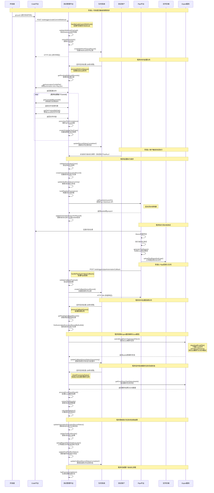

# 测试管理自动化测试集成技术方案 - 完整版

## 一、项目概述

### 1.1 背景与目标
本方案实现测试管理平台与Code代码平台、Pipe流水线平台、Export导出服务的深度集成，构建完整的自动化测试闭环：
- **Code平台集成**：监听代码变更，自动同步测试用例
- **Pipe平台集成**：触发自动化执行，回收执行结果  
- **Export服务集成**：支持执行记录导出，生成测试报告
- **测试管理平台**：统一管理用例生命周期和执行记录

### 1.2 核心能力
1. **智能用例同步**：基于Webhook监听，自动解析代码变更，同步测试用例
2. **流水线执行调度**：支持Maven/JDK版本选择，触发Pipe流水线自动化测试
3. **结果智能回收**：接收执行结果，更新测试状态，解析测试报告
4. **数据导出能力**：支持执行记录批量导出，生成Excel格式测试报告

## 二、整体系统架构

### 2.1 核心架构图
```
┌─────────────────────────────────────────────────────────────────┐
│                      测试管理平台                                │
├─────────────────────────────────────────────────────────────────┤
│  ┌───────────────┐  ┌───────────────┐  ┌───────────────┐      │
│  │  Webhook接收  │  │  用例管理     │  │  执行管理     │      │
│  │  - 队列存储   │  │  - 创建/更新  │  │  - 触发执行   │      │
│  │  - 异步处理   │  │  - 状态跟踪   │  │  - 状态监控   │      │
│  └───────────────┘  └───────────────┘  └───────────────┘      │
│                                                                │
│  ┌───────────────┐  ┌───────────────┐  ┌───────────────┐      │
│  │  回调处理     │  │  报告解析     │  │  数据导出     │      │
│  │  - 状态更新   │  │  - 结果统计   │  │  - Excel生成  │      │
│  │  - 文件下载   │  │  - 错误分析   │  │  - 批量导出   │      │
│  └───────────────┘  └───────────────┘  └───────────────┘      │
└─────────────────────────────────────────────────────────────────┘
           ▲                    │                    ▼
           │                    │                    │
┌─────────────────┐    ┌─────────────────┐    ┌─────────────────┐
│   Code平台      │    │   Export服务    │    │   Pipe平台      │
│  - Git仓库      │    │  - 模板管理     │    │  - 流水线执行   │
│  - Webhook推送  │    │  - 数据转换     │    │  - 结果回调     │
│  - 文件管理     │    │  - 文件生成     │    │  - 日志收集     │
└─────────────────┘    └─────────────────┘    └─────────────────┘
```

### 2.2 服务交互关系
```
测试管理平台 ←→ Code平台：    webhook监听, 文件获取, diff查询
测试管理平台 ←→ Pipe平台：    执行触发, 状态回调, 日志下载  
测试管理平台 ←→ Export服务：  数据导出, 报告生成, 模板管理
Code平台 ←→ Pipe平台：        代码拉取, 构建触发, 制品管理
```

## 三、详细功能流程

### 3.1 自动化用例同步流程

#### 3.1.1 Webhook接收阶段（同步处理，3秒内响应）
**核心方法**: `handleCodeCommitWebhook(payload)`
- **步骤1**: `validateWebhookPayload()` - 验证webhook请求合法性
- **步骤2**: `extractBranchInfo()` - 提取分支信息，过滤非目标分支
- **步骤3**: `createWebhookQueueRecord()` - 存储到队列表，状态设为pending
- **步骤4**: `respondImmediately()` - 立即返回200响应

#### 3.1.2 异步队列处理阶段（定时任务，30秒间隔）
**核心方法**: `processWebhookQueue()`
- **步骤1**: `getPendingWebhookRecords(batchSize=5)` - 批量获取待处理记录
- **步骤2**: `updateRecordStatus(recordId, 'processing')` - 更新处理状态
- **步骤3**: `getAutomationConfigFile(repositoryId, branch)` - 获取automation-test-map.json
- **步骤4**: `processCommitDiffs(commitIds, configMappings)` - 处理每个commit的diff
- **步骤5**: `parseAndSyncTestCases(fileDiffs, config)` - 解析并同步测试用例
- **步骤6**: `updateRecordStatus(recordId, 'completed')` - 更新完成状态

#### 3.1.3 测试用例解析与同步
**核心方法**: `parseTestCasesFromFile(fileContent, diff, config)`
- **Java解析**: `parseJavaTestAnnotations()` - 解析@TestId注解
- **变更检测**: `isLineInDiffRange()` - 检查方法是否在变更范围内
- **用例构建**: `buildTestCaseData()` - 构建标准用例数据结构

**核心方法**: `syncTestCaseToManagement(testCaseData, moduleId)`
- **存在性查询**: `queryExistingCaseByAutomationId()` - 通过IQL查询现有用例
- **创建用例**: `createNewTestCase()` - 创建新的自动化测试用例
- **更新用例**: `updateExistingTestCase()` - 更新已有用例信息

### 3.2 自动化执行调度流程

#### 3.2.1 前端交互流程
**核心方法**: `renderAutomationExecutionButton()`
- **自动化识别**: `isAutomationCase()` - 判断是否为自动化用例
- **UI渲染**: `showExecutionOptions()` - 显示执行按钮选项
- **版本选择**: `showMavenVersionSelector()` - 弹出Maven/JDK版本选择框
- **执行触发**: `triggerAutomationExecution()` - 调用后端统一执行接口
- **状态展示**: `showExecutionStatus()` - 展示执行状态和跳转链接

#### 3.2.2 后端统一执行接口
**核心类**: `AutomationExecutionHandler`
- **参数验证**: `validateExecutionParams()` - 验证必填参数和格式
- **状态检查**: `checkCurrentExecutionStatus()` - 检查是否有正在执行的任务
- **记录创建**: `createExecutionRecord()` - 创建自动化执行记录
- **状态更新**: `updateTestExecutionStatus()` - 批量更新测试执行状态
- **流水线调用**: `callPipeWebHookAPI()` - 调用Pipe平台WebHook接口
- **信息回填**: `updateExecutionRecordWithPipeInfo()` - 更新buildId和跳转URL
- **错误回滚**: `rollbackExecutionStatusOnError()` - 异常时回滚状态

#### 3.2.3 Pipe流水线集成
**核心方法**: `integrateWithPipePlatform(executionParams)`
- **参数构建**: `buildPipelineParameters()` - 构建物料参数和全局参数
- **WebHook调用**: `invokePipeWebHook()` - 调用Pipe WebHook API
- **响应处理**: `handlePipeResponse()` - 处理返回的buildId和jumpUrl
- **回调配置**: `setupCallbackURL()` - 设置执行完成回调地址

### 3.3 执行结果回调处理流程

#### 3.3.1 Pipe回调接口处理
**核心方法**: `handlePipeAutomationCallback(payload)`
- **参数验证**: `validateCallbackPayload()` - 验证buildId和status等必需参数
- **记录查找**: `findExecutionRecordByBuildId()` - 根据buildId查找执行记录
- **状态更新**: `updateExecutionRecordStatus()` - 更新执行记录状态和时间
- **文件下载**: `downloadExecutionFiles()` - 下载日志和报告文件
- **报告解析**: `parseTestReportFile()` - 解析Excel格式测试报告
- **结果统计**: `calculateExecutionStatistics()` - 统计成功/失败数量
- **状态同步**: `syncTestExecutionStatus()` - 更新关联测试执行状态

#### 3.3.2 测试报告解析与处理
**核心方法**: `parseAndProcessTestReport(reportFileUrl)`
- **文件下载**: `downloadReportFile()` - 从URL下载Excel报告文件
- **Excel解析**: `parseExcelContent()` - 解析Excel工作表内容
- **数据转换**: `transformReportDataToStandardFormat()` - 转换为标准数据格式
- **结果统计**: `calculateTestResults()` - 统计各种状态的用例数量
- **错误分析**: `analyzeFailureReasons()` - 分析失败用例的错误原因

### 3.4 Export服务集成流程

#### 3.4.1 执行记录导出功能
**核心方法**: `exportExecutionRecords(exportParams)`
- **数据查询**: `queryExecutionRecordsForExport()` - 根据条件查询执行记录
- **数据转换**: `transformDataForExport()` - 转换为Export服务所需格式
- **模板选择**: `selectExportTemplate()` - 选择合适的导出模板
- **服务调用**: `callExportService()` - 调用Export服务生成文件
- **文件下载**: `provideDownloadLink()` - 提供文件下载链接

#### 3.4.2 批量数据导出处理
**核心方法**: `handleBatchExport(batchExportRequest)`
- **权限验证**: `validateExportPermission()` - 验证用户导出权限
- **数据分页**: `paginateExportData()` - 分页处理大量数据导出
- **异步任务**: `createAsyncExportTask()` - 创建异步导出任务
- **进度跟踪**: `trackExportProgress()` - 跟踪导出进度
- **完成通知**: `notifyExportCompletion()` - 导出完成后通知用户

#### 3.4.3 测试报告生成
**核心方法**: `generateTestReport(reportTemplate, dataRange)`
- **模板管理**: `loadReportTemplate()` - 加载报告模板配置
- **数据聚合**: `aggregateTestData()` - 聚合测试数据统计
- **图表生成**: `generateCharts()` - 生成统计图表
- **报告组装**: `assembleTestReport()` - 组装完整测试报告
- **格式输出**: `outputReportFile()` - 输出Excel/PDF格式报告

## 四、数据模型设计

### 4.1 核心数据表

#### 4.1.1 AutomationWebhookQueue（Webhook队列表）
```sql
CREATE TABLE automation_webhook_queue (
  id VARCHAR(50) PRIMARY KEY,
  webhook_uuid VARCHAR(100),
  repository_id VARCHAR(50),
  repository_name VARCHAR(100),
  branch_name VARCHAR(100),
  commit_ids JSON,
  payload JSON,
  status VARCHAR(20) DEFAULT 'pending',
  retry_count INT DEFAULT 0,
  created_time DATETIME DEFAULT CURRENT_TIMESTAMP,
  processed_time DATETIME,
  INDEX idx_status (status),
  INDEX idx_created_time (created_time)
);
```

#### 4.1.2 AutomationSyncLog（同步记录表）
```sql
CREATE TABLE automation_sync_log (
  id VARCHAR(50) PRIMARY KEY,
  webhook_queue_id VARCHAR(50),
  repository_id VARCHAR(50),
  repository_name VARCHAR(100),
  commit_id VARCHAR(100),
  branch_name VARCHAR(100),
  sync_status VARCHAR(20),
  processed_files INT DEFAULT 0,
  created_cases INT DEFAULT 0,
  updated_cases INT DEFAULT 0,
  skipped_cases INT DEFAULT 0,
  failed_cases INT DEFAULT 0,
  error_details JSON,
  sync_start_time DATETIME,
  sync_end_time DATETIME,
  created_time DATETIME DEFAULT CURRENT_TIMESTAMP
);
```

#### 4.1.3 AutomationExecutionRecord（执行记录表）
```sql
CREATE TABLE automation_execution_record (
  id VARCHAR(50) PRIMARY KEY,
  execution_id VARCHAR(100) UNIQUE,
  build_id VARCHAR(100),
  test_execution_ids JSON,
  maven_version VARCHAR(20),
  jdk_version VARCHAR(20),
  status VARCHAR(20) DEFAULT 'pending',
  trigger_user VARCHAR(100),
  trigger_time DATETIME,
  complete_time DATETIME,
  pipe_jump_url TEXT,
  pipe_log_url TEXT,
  report_url TEXT,
  test_results JSON,
  success_count INT DEFAULT 0,
  failed_count INT DEFAULT 0,
  created_time DATETIME DEFAULT CURRENT_TIMESTAMP
);
```

### 4.2 测试用例自定义字段
```typescript
// 在测试用例上新增的自定义字段
interface AutomationCustomFields {
  automationCaseId: string;          // @TestId注解值
  automationFilePath: string;        // 代码文件路径
  automationRepository: string;      // 仓库名称
  automationClassName: string;       // Java类名
  automationMethodName: string;      // 测试方法名
  automationLastCommit: string;      // 最后同步的CommitID
  automationLastSyncTime: string;    // 最后同步时间
  automationFramework: string;       // 测试框架（JUnit/TestNG）
}
```

## 五、配置管理

### 5.1 代码仓库配置文件
**文件路径：** `automation-test-map.json`（位于代码仓库根目录）
```json
{
  "testingFramework": "JUnit",
  "frameworkVersion": "5.8.2",
  "mappings": {
    "src/test/java/com/cfca/test/Code6601Test.java": "全部用例库/用户认证",
    "src/test/java/com/cfca/test/Code6602Test.java": "全部用例库/工作台管理",
    "src/test/java/com/cfca/test/Code6603Test.java": "全部用例库/系统管理"
  }
}
```

### 5.2 环境变量配置
```bash
# 代码平台配置
CODE_PLATFORM_BASE_URL=https://dce1-dev.gitee.work/api/v8
CODE_PLATFORM_TOKEN=${CODE_PLATFORM_TOKEN}
CODE_PLATFORM_ENTERPRISE=DCE3

# 同步配置
SYNC_BRANCH=${SYNC_BRANCH:-master}    # 默认master分支
SYNC_QUEUE_SIZE=5                     # 队列批次大小
SYNC_RETRY_MAX=3                      # 最大重试次数
SYNC_TIMEOUT=120000                   # 超时时间2分钟

# 流水线配置
IPIPE_BASE_URL=http://your-ipipe-domain.com
IPIPE_TOKEN=eyJhbGciOiJIUzI1NiIsInR5cCI6IkpXVCJ9...
IPIPE_SECRET=6d83560f3c11408fa1b257341a7219d9
CALLBACK_BASE_URL=http://test-manager-server:8467

# 回调鉴权配置
PIPE_CALLBACK_TOKEN=a:ug9yu2qzh84rl102az3usdex

# Maven版本配置
DEFAULT_MAVEN_VERSION=3.8.1
SUPPORTED_MAVEN_VERSIONS=3.6.3,3.8.1,3.9.0

# Export服务配置
EXPORT_SERVICE_BASE_URL=http://export-service-domain.com
EXPORT_SERVICE_TOKEN=${EXPORT_SERVICE_TOKEN}
EXPORT_SERVICE_TIMEOUT=300000         # 5分钟超时
EXPORT_DEFAULT_FORMAT=xlsx            # 默认导出格式
EXPORT_BATCH_SIZE=1000               # 批量导出大小
EXPORT_MAX_ASYNC_TASKS=5             # 最大异步任务数

# 文件存储配置
FILE_STORAGE_BASE_URL=http://storage-service.com
FILE_STORAGE_TOKEN=${FILE_STORAGE_TOKEN}
FILE_DOWNLOAD_TIMEOUT=60000          # 文件下载超时1分钟

# 通知配置
NOTIFICATION_WEBHOOK_URL=${NOTIFICATION_WEBHOOK_URL}
EXPORT_COMPLETION_NOTIFY=true        # 导出完成是否通知
```

## 六、关键接口规范

### 6.1 内部接口

#### 6.1.1 Webhook接收接口
```
POST /webtriggers/codeCommitWebhook
Content-Type: application/json

Request:
{
  "repository": {
    "id": "12345",
    "name": "atmTestCode",
    "url": "https://gitee.example.com/atmTestCode.git"
  },
  "commits": [
    {
      "id": "abc123def456",
      "message": "Add new test cases",
      "added": ["src/test/java/NewTest.java"],
      "modified": ["src/test/java/ExistingTest.java"]
    }
  ],
  "ref": "refs/heads/master"
}

Response:
{
  "success": true,
  "queueId": "queue_20240115_143052_abcd"
}
```

#### 6.1.2 统一执行接口
```
POST /api/automation/execute
Content-Type: application/json
Authorization: Bearer {user-session-token}

Request:
{
  "testExecutionIds": ["exec_001", "exec_002"],
  "mavenVersion": "3.8.1",
  "jdkVersion": "11"
}

Response:
{
  "success": true,
  "data": {
    "executionId": "exec_20240115_143052_8f3a",
    "buildId": "pipe_build_12345",
    "pipeJumpUrl": "https://pipe.gitee.com/builds/12345",
    "message": "自动化测试已成功触发"
  }
}
```

#### 6.1.3 流水线回调接口
```
POST /webtriggers/pipeAutomationCallback
Content-Type: application/json
X-Parse-Application-Id: osc
X-Parse-Session-Token: a:ug9yu2qzh84rl102az3usdex

Request:
{
  "buildId": "pipe_build_12345",
  "status": "completed",
  "pipeJmpUrl": "https://pipe.gitee.com/builds/12345",
  "pipeLogFile": "https://storage.example.com/logs/build_12345.txt",
  "reportFile": "https://storage.example.com/reports/build_12345.xlsx"
}

Response:
{
  "success": true,
  "data": {
    "executionId": "exec_20240115_143052_8f3a",
    "buildId": "pipe_build_12345",
    "status": "completed",
    "updatedTestExecutions": 5
  }
}
```

### 6.2 外部接口调用

#### 6.2.1 Code平台接口
```bash
# 获取Commit Diff
GET ${CODE_PLATFORM_BASE_URL}/projects/{repositoryId}/repository/commits/{commitId}/diff
Headers:
  Private-Token: ${CODE_PLATFORM_TOKEN}
  enterprise: ${CODE_PLATFORM_ENTERPRISE}

# 获取文件内容
GET ${CODE_PLATFORM_BASE_URL}/projects/{repositoryId}/repository/files/{encodedPath}/raw?ref={branch}
Headers:
  Private-Token: ${CODE_PLATFORM_TOKEN}
  enterprise: ${CODE_PLATFORM_ENTERPRISE}

# 获取配置文件
GET ${CODE_PLATFORM_BASE_URL}/projects/{repositoryId}/repository/files/automation-test-map.json/raw
```

#### 6.2.2 Pipe平台接口
```bash
# 触发流水线执行
POST /api/ipipe/pipeline/rest/v1/openApi/webHook
Content-Type: application/x-www-form-urlencoded

Body:
token=${IPIPE_TOKEN}&
secret=${IPIPE_SECRET}&
materialParams=${encodedMaterialParams}&
allParams=${encodedAllParams}

# 执行状态查询（可选）
GET /api/ipipe/pipeline/builds/{buildId}/status
Headers:
  Authorization: Bearer ${IPIPE_TOKEN}
```

#### 6.2.3 Export服务接口
```bash
# 创建导出任务
POST ${EXPORT_SERVICE_BASE_URL}/api/export/create
Content-Type: application/json
Headers:
  Authorization: Bearer ${EXPORT_SERVICE_TOKEN}

Body:
{
  "templateId": "automation_execution_report",
  "dataSource": "test_manager",
  "exportFormat": "xlsx",
  "parameters": {
    "dateRange": "2024-01-01,2024-12-31",
    "includeCharts": true,
    "includeStatistics": true
  }
}

# 查询导出状态
GET ${EXPORT_SERVICE_BASE_URL}/api/export/{taskId}/status

# 下载导出文件
GET ${EXPORT_SERVICE_BASE_URL}/api/export/{taskId}/download

# 批量导出接口
POST ${EXPORT_SERVICE_BASE_URL}/api/export/batch
Content-Type: application/json

Body:
{
  "exportType": "execution_records",
  "batchSize": 1000,
  "filters": {
    "status": ["completed", "failed"],
    "dateRange": "last_30_days"
  },
  "callbackUrl": "${TEST_MANAGER_BASE_URL}/webtriggers/exportCallback"
}
```

## 七、异常处理策略

### 7.1 错误分类与处理

| 错误类型 | 处理策略 | 重试机制 | 记录方式 |
|---------|---------|---------|----------|
| 配置文件不存在 | 跳过处理，记录日志 | 不重试 | sync_log表 |
| 目录不存在 | 跳过该用例 | 不重试 | error_details字段 |
| API调用失败 | 重试3次，记录错误 | 指数退避 | 详细错误信息 |
| 解析失败 | 跳过该文件，继续处理 | 不重试 | error_details字段 |
| 超时错误 | 标记失败，支持手动重试 | 不自动重试 | 记录超时信息 |
| 流水线调用失败 | 回滚状态，记录错误 | 不重试 | execution_record表 |

### 7.2 重试机制
```typescript
class RetryHandler {
  async executeWithRetry<T>(
    operation: () => Promise<T>, 
    maxRetries: number = 3,
    backoffMs: number = 1000
  ): Promise<T> {
    for (let attempt = 0; attempt <= maxRetries; attempt++) {
      try {
        return await operation();
      } catch (error) {
        if (attempt === maxRetries) {
          throw error;
        }
        
        // 指数退避
        const delay = backoffMs * Math.pow(2, attempt);
        await new Promise(resolve => setTimeout(resolve, delay));
      }
    }
  }
}
```

### 7.3 状态回滚机制
```typescript
async function rollbackExecutionStatus(testExecutionIds: string[], error: Error) {
  try {
    // 回滚测试执行状态
    await updateTestExecutionsStatus(testExecutionIds, 'failed');
    
    // 记录错误信息
    await logExecutionError({
      testExecutionIds,
      error: error.message,
      stack: error.stack,
      timestamp: new Date()
    });
    
    console.log('[Rollback] 成功回滚执行状态', { testExecutionIds });
  } catch (rollbackError) {
    console.error('[Rollback] 回滚失败', rollbackError);
  }
}
```

## 八、监控与运维

### 8.1 核心监控指标
```typescript
interface MonitoringMetrics {
  // Webhook处理指标
  webhookReceived: number;          // 接收的webhook数量
  webhookProcessed: number;         // 处理成功数量
  webhookFailed: number;           // 处理失败数量
  
  // 用例同步指标
  casesCreated: number;            // 创建用例数
  casesUpdated: number;            // 更新用例数
  casesSkipped: number;            // 跳过用例数
  
  // 执行调度指标
  executionsTriggered: number;     // 触发执行数
  executionsSucceeded: number;     // 成功执行数
  executionsFailed: number;        // 失败执行数
  
  // 性能指标
  avgWebhookProcessTime: number;   // 平均处理时间
  queueSize: number;               // 队列积压数量
  avgExecutionTime: number;        // 平均执行时间
}
```

### 8.2 日志规范
```typescript
// 统一日志格式
const logger = {
  info: (message: string, data?: any) => {
    console.log(`[${new Date().toISOString()}][INFO] ${message}`, 
                data ? JSON.stringify(data, null, 2) : '');
  },
  
  error: (message: string, error?: Error, data?: any) => {
    console.error(`[${new Date().toISOString()}][ERROR] ${message}`, {
      error: error?.message,
      stack: error?.stack,
      data: data
    });
  },
  
  webhook: (message: string, data?: any) => {
    console.log(`[${new Date().toISOString()}][WEBHOOK] ${message}`, data);
  },
  
  execution: (message: string, data?: any) => {
    console.log(`[${new Date().toISOString()}][EXECUTION] ${message}`, data);
  }
};

// 使用示例
logger.webhook('接收到webhook事件', { 
  repositoryId: repo.id, 
  branch: branch, 
  commitCount: commits.length 
});

logger.execution('触发自动化执行', {
  executionId: executionId,
  testExecutionIds: testExecutionIds,
  mavenVersion: mavenVersion
});
```

### 8.3 告警规则
```typescript
// 告警配置
const alertRules = {
  // Webhook处理失败率超过10%
  webhookFailureRate: {
    threshold: 0.1,
    window: '5m',
    action: 'send_notification'
  },
  
  // 队列积压超过100条
  queueBacklog: {
    threshold: 100,
    window: '1m',
    action: 'send_notification'
  },
  
  // 执行失败率超过20%
  executionFailureRate: {
    threshold: 0.2,
    window: '10m',
    action: 'send_notification'
  },
  
  // API响应时间超过30秒
  apiResponseTime: {
    threshold: 30000,
    window: '1m',
    action: 'send_notification'
  }
};
```

## 九、性能优化策略

### 9.1 并发控制
```typescript
// 限制并发处理数量
const concurrencyLimit = 3;
const semaphore = new Semaphore(concurrencyLimit);

async function processWithConcurrencyControl<T>(
  items: T[], 
  processor: (item: T) => Promise<void>
) {
  const promises = items.map(async (item) => {
    const release = await semaphore.acquire();
    try {
      await processor(item);
    } finally {
      release();
    }
  });
  
  await Promise.all(promises);
}
```

### 9.2 缓存策略
```typescript
// 文件内容缓存（避免重复获取相同文件）
class FileContentCache {
  private cache = new Map<string, { content: string, timestamp: number }>();
  private ttl = 5 * 60 * 1000; // 5分钟TTL
  
  async getFileContent(repositoryId: string, filePath: string, commitId: string): Promise<string> {
    const cacheKey = `${repositoryId}:${filePath}:${commitId}`;
    const cached = this.cache.get(cacheKey);
    
    if (cached && Date.now() - cached.timestamp < this.ttl) {
      return cached.content;
    }
    
    const content = await this.fetchFileContent(repositoryId, filePath, commitId);
    this.cache.set(cacheKey, { content, timestamp: Date.now() });
    
    return content;
  }
}
```

### 9.3 批量操作优化
```typescript
// 批量更新测试执行状态
async function batchUpdateTestExecutions(updates: Array<{id: string, status: string}>) {
  const batchSize = 50;
  const batches = [];
  
  for (let i = 0; i < updates.length; i += batchSize) {
    batches.push(updates.slice(i, i + batchSize));
  }
  
  const promises = batches.map(batch => 
    updateTestExecutionsBatch(batch)
  );
  
  await Promise.all(promises);
}
```

## 十、完整时序图



### 方法名中文对照表

#### 阶段1：代码提交触发用例同步
| 英文方法名 | 中文释义 |
|-----------|---------|
| `handleCodeCommitWebhook()` | 处理代码提交Webhook |
| `validateWebhookPayload()` | 验证Webhook请求参数 |
| `extractBranchInfo()` | 提取分支信息 |
| `createWebhookQueueRecord()` | 创建Webhook队列记录 |
| `processWebhookQueue()` | 处理Webhook队列 |
| `getPendingWebhookRecords()` | 获取待处理记录 |
| `getAutomationConfigFile()` | 获取automation-test-map.json |
| `getCommitDiff()` | 获取提交变更差异 |
| `getFileContent()` | 获取Java测试文件内容 |
| `parseJavaTestAnnotations()` | 解析@TestId注解 |
| `createOrUpdateTestCase()` | 创建或更新测试用例 |
| `updateRecordStatus()` | 更新队列记录状态 |

#### 阶段2：程序处理执行请求
| 英文方法名 | 中文释义 |
|-----------|---------|
| `validateAutomationCase()` | 验证自动化用例 |
| `createAutomationExecutionRecord()` | 创建自动化执行记录 |
| `updateTestRunStatus()` | 更新测试执行状态 |
| `buildPipelineParameters()` | 构建流水线参数 |
| `callPipeWebHookAPI()` | 调用Pipe WebHook API |
| `updateAutomationExecutionRecord()` | 更新自动化执行记录buildId信息 |
| `generateTestReport()` | 生成Excel测试报告 |
| `uploadTestReportAndLogs()` | 上传报告和日志文件 |

#### 阶段3：程序处理执行结果回调
| 英文方法名 | 中文释义 |
|-----------|---------|
| `handlePipeAutomationCallback()` | 处理Pipe回调 |
| `validateCallbackPayload()` | 验证回调参数 |
| `createCallbackQueueRecord()` | 创建回调队列记录 |
| `processCallbackQueue()` | 处理回调队列 |
| `getPendingCallbackRecords()` | 获取待处理回调记录 |
| `findAutomationExecutionRecordByBuildId()` | 查找自动化执行记录 |
| `submitExcelParseTask()` | 提交Excel解析任务 |
| `downloadExcelFile()` | 下载Excel文件 |
| `parseExcelToJson()` | 将Excel解析为JSON格式 |
| `updateCallbackQueueStatus()` | 更新回调队列状态 |
| `checkProcessingTasks()` | 检查正在处理的解析任务 |
| `getExcelParseTaskStatus()` | 查询解析任务状态 |
| `processExcelParseResult()` | 处理Excel解析结果 |
| `extractTestResults()` | 提取测试结果数据 |
| `calculateStatistics()` | 计算成功/失败统计 |
| `updateAutomationExecutionRecordStatus()` | 更新自动化执行记录状态 |
| `updateTestRunResults()` | 更新测试执行结果 |
| `uploadReportFileToTestExecution()` | 上传报告文件到测试执行任务 |
| `updateFinalTestRunStatus()` | 更新最终测试执行状态 |
| `updateCallbackRecordStatus()` | 更新回调队列记录状态 |
| `logProcessCompletion()` | 记录处理完成日志 |

## 十一、部署实施计划

### 11.1 分阶段实施

#### Phase 1: 基础环境搭建（2天）
- [ ] 在manifest.yml中声明数据库表和自定义字段
- [ ] 配置环境变量和Webhook地址
- [ ] 创建基础目录结构
- [ ] 编写核心工具类和帮助函数

#### Phase 2: 用例同步功能（3天）
- [ ] 实现Webhook接收接口
- [ ] 实现队列存储和处理机制
- [ ] 实现代码解析和用例同步逻辑
- [ ] 集成测试用例同步流程

#### Phase 3: 自动化执行功能（3天）
- [ ] 实现前端Maven版本选择组件
- [ ] 实现后端统一执行接口
- [ ] 集成Pipe平台WebHook调用
- [ ] 测试执行触发流程

#### Phase 4: 结果回调处理（2天）
- [ ] 实现Pipe回调接口
- [ ] 实现测试报告解析逻辑
- [ ] 实现执行状态更新机制
- [ ] 测试完整执行闭环

#### Phase 5: 管理页面和优化（2天）
- [ ] 实现同步记录管理页面
- [ ] 实现手动重试功能
- [ ] 性能优化和错误处理完善
- [ ] 文档编写和培训

### 11.2 质量保证
- **单元测试覆盖率**: > 80%
- **接口测试**: 所有关键接口100%覆盖
- **性能测试**: 支持并发50个webhook事件处理
- **容灾测试**: 验证各种异常场景的处理

### 11.3 验收标准
1. ✅ Code平台推送webhook后，3秒内返回响应
2. ✅ 测试用例能正确同步，包括创建、更新逻辑
3. ✅ 自动化执行能成功触发Pipe流水线
4. ✅ 执行结果能正确回调并更新状态
5. ✅ 管理页面能查看同步记录和手动重试
6. ✅ 异常情况有完善的错误处理和日志记录

---

**文档版本**: v1.0  
**创建时间**: 2024-01-15  
**最后更新**: 2024-01-15  
**文档状态**: 实施中

本技术方案涵盖了自动化测试集成的完整流程，从Code平台的webhook监听，到Pipe平台的执行调度，再到结果的智能回收，形成了完整的自动化测试闭环。通过统一的接口设计、完善的错误处理机制和详细的监控策略，确保系统的稳定性和可维护性。