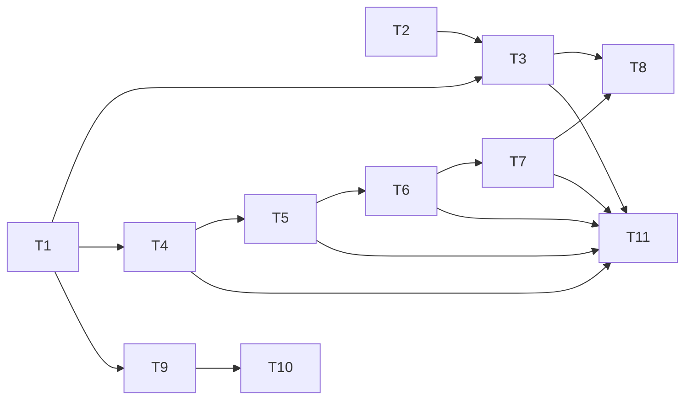

# 自动化用例流水线执行 - TodoList

## 任务状态说明
- ⏳ PENDING - 待开始
- 🚧 IN_PROGRESS - 进行中  
- ✅ DONE - 已完成
- ❌ BLOCKED - 阻塞中

## 当前任务
**当前正在处理：** 无（待开始）

## 任务列表

### T1. 设计数据模型和表结构
**状态：** ⏳ PENDING  
**描述：** 设计核心数据结构
- [ ] AutomationExecutionRecord（自动化执行记录表）
- [ ] PipeCallbackQueue（Pipe回调队列表）
- [ ] 测试执行自定义字段（automation_status）
- [ ] manifest.yml中声明自定义字段
**依赖：** 无
**输出：** 数据模型定义文件 + manifest配置

---

### T2. 实现前端触发按钮和参数选择界面
**状态：** ⏳ PENDING  
**描述：** 前端交互界面开发
- [ ] 在测试执行列表页面添加"自动化执行"按钮
- [ ] 实现批量选择测试执行功能
- [ ] 开发参数选择弹窗（Maven/JDK版本）
- [ ] 添加执行状态提示（根据automation_status字段）
- [ ] 执行中状态禁用按钮
**依赖：** T1（需要automation_status字段）
**输出：** React组件 AutomationExecuteModal

---

### T3. 实现触发流水线接口
**状态：** ⏳ PENDING  
**描述：** 实现调用Pipe WebHook的后端接口
- [ ] 实现 POST /api/automation/trigger
- [ ] 生成executionId
- [ ] 调用Pipe WebHook API
- [ ] 保存buildId映射关系
**依赖：** T1（需要数据模型）
**输出：** 触发接口实现

---

### T4. 实现pipe回调webhook接口  
**状态：** ⏳ PENDING  
**描述：** 接收Pipe执行完成的回调
- [ ] 实现 POST /webtriggers/pipeAutomationCallback
- [ ] 验证Session Token
- [ ] 将回调数据加入队列
- [ ] 立即返回响应（异步处理）
**依赖：** T1（需要队列表）
**输出：** Webhook接口实现

---

### T5. 实现回调队列处理机制
**状态：** ⏳ PENDING  
**描述：** 异步处理回调队列
- [ ] 定时任务配置（30秒执行一次）
- [ ] 批量获取待处理记录
- [ ] 并发控制（每次5条）
- [ ] 状态更新机制
**依赖：** T4（需要队列数据）
**输出：** 队列处理器实现

---

### T6. 实现Excel解析服务调用
**状态：** ⏳ PENDING  
**描述：** 调用Word服务解析测试报告
- [ ] 调用gitee-proxima-word-export服务
- [ ] 解析Excel格式测试报告
- [ ] 提取测试结果JSON
- [ ] 错误处理
**依赖：** T5（队列处理时调用）
**输出：** Excel解析模块

---

### T7. 实现测试结果记录存储
**状态：** ⏳ PENDING  
**描述：** 保存解析后的测试结果
- [ ] 批量创建测试结果记录
- [ ] 关联executionId
- [ ] 统计执行结果（成功/失败/跳过）
- [ ] 并行写入优化
**依赖：** T6（需要解析结果）
**输出：** 结果存储模块

---

### T8. 实现状态流转管理
**状态：** ⏳ PENDING  
**描述：** 执行状态机管理
- [ ] 定义状态转换规则
- [ ] 实现状态转换验证
- [ ] 状态变更事件触发
- [ ] 异常状态处理
**依赖：** T3, T5, T7（各阶段状态更新）
**输出：** ExecutionStatusManager类

---

### T9. 实现执行记录查询接口
**状态：** ⏳ PENDING  
**描述：** 查询执行历史记录
- [ ] 实现 GET /api/automation/executions
- [ ] 支持分页查询
- [ ] 支持状态筛选
- [ ] 按时间排序
**依赖：** T1（需要数据模型）
**输出：** 查询接口实现

---

### T10. 实现前端执行结果展示界面
**状态：** ⏳ PENDING  
**描述：** 执行详情和结果展示
- [ ] 执行详情页面组件
- [ ] 测试结果列表展示
- [ ] 执行统计图表
- [ ] 日志下载功能
- [ ] 状态轮询更新（执行中时）
**依赖：** T9（调用查询接口）
**输出：** ExecutionDetailPage组件

---

### T11. 异常处理和重试机制
**状态：** ⏳ PENDING  
**描述：** 全局异常处理策略
- [ ] 错误分类处理
- [ ] 指数退避重试策略
- [ ] 错误日志记录
- [ ] 告警通知机制
**依赖：** T3-T7（各模块错误处理）
**输出：** ErrorHandler类

---

## 执行顺序建议

### 并行执行组：
1. **第一批（可并行）：** T1, T2
2. **第二批（依赖T1）：** T3, T4, T9
3. **第三批（依赖T4）：** T5
4. **第四批（依赖T5）：** T6
5. **第五批（依赖T6）：** T7
6. **第六批（依赖多个）：** T8, T10, T11

## 进度统计
- **总任务数：** 11
- **已完成：** 0
- **进行中：** 0
- **待开始：** 11
- **完成率：** 0%

## 下一步行动
1. 开始 T1 - 设计数据模型和表结构
2. 并行开始 T2 - 实现前端触发按钮

## 更新记录
- 2024-01-XX 10:00 - 创建TodoList，所有任务初始化为PENDING状态