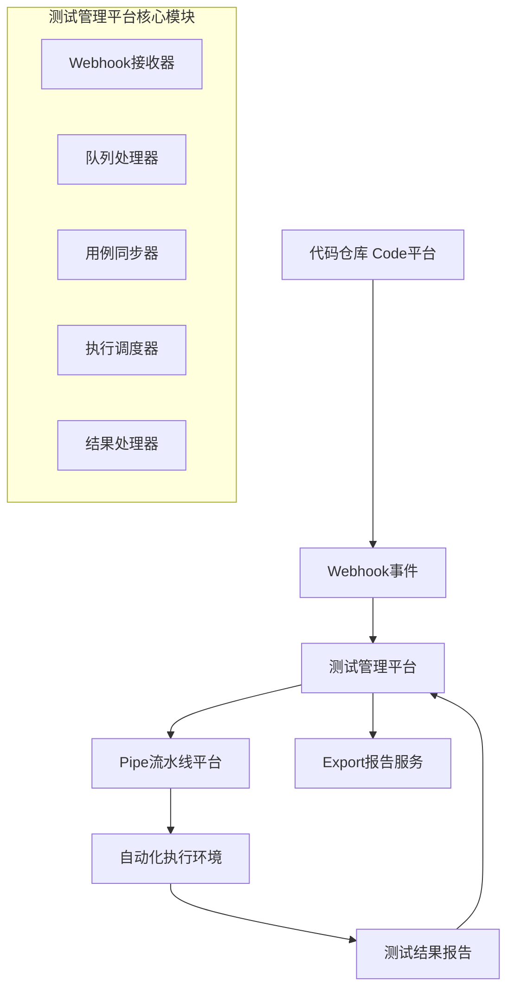

# 测试管理插件 - 新人培训文档 🚀

> **版本**：v4.38.552  
> **更新时间**：2024年  
> **目标读者**：新入职开发人员，特别是负责自动化测试集成功能的同事

## 一、项目概述

### 1.1 项目背景与定位
测试管理插件（Test Manager Plugin）是 **Proxima 企业级研发管理平台** 的核心组件之一，专注于提供全生命周期的测试管理解决方案。

**业务价值**：
- 统一管理企业测试资产，建立标准化测试流程
- 实现测试与研发流程深度集成，提升研发效率
- 支持手动测试与自动化测试并行，满足不同场景需求
- 提供丰富的测试数据分析，支持质量决策

### 1.2 核心功能模块
- 🗂️ **测试用例库管理**：分层级组织测试用例，支持用例复用
- 📋 **测试计划管理**：制定测试计划，分配测试任务，跟踪进度
- 🎯 **测试执行管理**：在线执行测试，记录执行结果和缺陷
- 🤖 **自动化测试集成**：与 Code/Pipe 平台深度集成，实现自动化闭环 ⭐
- 📊 **测试报告分析**：多维度测试数据分析和报告生成
- 🔗 **缺陷关联管理**：与缺陷管理系统无缝集成
- 🎨 **脑图导入导出**：支持 XMind 格式的用例批量导入
- ⚙️ **系统配置管理**：灵活的字段配置、工作流配置

### 1.3 技术架构概览

#### 前端技术栈
- **框架**：React 17 + TypeScript 4.4
- **UI库**：Ant Design 5.7 + 自定义组件库
- **状态管理**：React Query + Recoil/Jotai
- **构建工具**：Webpack 5 + Babel 7
- **开发工具**：ESLint + Prettier + Husky

#### 后端技术栈  
- **运行环境**：Node.js + Parse Server
- **核心SDK**：Proxima SDK + Apps SDK
- **数据库**：基于 Parse 的 MongoDB
- **定时任务**：ScheduledTrigger (2秒间隔)
- **文件存储**：支持多种云存储方案

#### 部署架构
- **插件模式**：通过 manifest.yml 配置，热插拔部署
- **多租户**：支持工作空间隔离
- **高可用**：支持集群部署，定时任务负载均衡

## 二、项目结构详解

### 2.1 完整目录结构

```
plugin-test-manager/                          # 测试管理插件根目录
├── 📁 src/                                  # 核心源代码目录
│   ├── 🎨 app/                             # 前端应用程序 (React + TypeScript)
│   │   ├── 🧩 components/                   # UI组件库
│   │   │   ├── business/                   # 业务相关组件
│   │   │   │   ├── AutomationExecuteModal/ # ⭐ 自动化执行弹窗
│   │   │   │   ├── TestRunModal/          # 测试执行弹窗
│   │   │   │   ├── TestEntitySelectorModal/ # 测试实体选择器
│   │   │   │   ├── PanelLayout/           # 面板布局组件
│   │   │   │   ├── Status/                # 状态展示组件
│   │   │   │   └── BatchResult/           # 批量操作结果
│   │   │   └── common/                    # 通用UI组件
│   │   │       ├── BusinessTable/         # 业务表格组件
│   │   │       ├── FilterSearch/          # 筛选搜索组件
│   │   │       └── PageLayout/            # 页面布局组件
│   │   ├── 📄 pages/                       # 页面模块 (路由页面)
│   │   │   ├── repository/                # 测试用例库管理
│   │   │   ├── plan/                      # 测试计划管理
│   │   │   ├── caseset/                   # 测试集管理
│   │   │   ├── approval/                  # 测试审批流程
│   │   │   ├── config/                    # 系统配置管理
│   │   │   ├── report/                    # 测试报告
│   │   │   └── xMindImport/               # XMind导入功能
│   │   ├── 🔧 lib/                         # 工具库和API封装
│   │   │   ├── api/                       # API接口定义
│   │   │   │   ├── case.ts               # 测试用例相关API
│   │   │   │   ├── runs.ts               # 测试执行相关API
│   │   │   │   └── report.ts             # 报告相关API
│   │   │   ├── automation/                # ⭐ 自动化功能API
│   │   │   │   ├── api.ts                # 自动化执行API
│   │   │   │   └── types.ts              # 自动化类型定义
│   │   │   ├── hooks/                     # React自定义Hooks
│   │   │   └── utils/                     # 前端工具函数
│   │   ├── 🎛️ services/                    # 数据服务层 (React Query)
│   │   └── 🔄 modules/                     # 业务模块
│   │       ├── panel/                     # 面板模块
│   │       └── beforeCreateOrUpdateModal/ # 创建/更新前置模块
│   │
│   ├── ⚡ trigger/                          # 后端触发器和API (Node.js)
│   │   ├── 🎯 modules/                     # 功能模块
│   │   │   ├── 🤖 automation/             # ⭐ 自动化测试核心模块
│   │   │   │   ├── automationExecutionHandler.ts  # 🔥 执行调度处理器
│   │   │   │   ├── caseSync.ts                    # 🔥 用例同步逻辑
│   │   │   │   ├── pipeCallback.ts               # 🔥 Pipe回调处理
│   │   │   │   ├── queueProcessor.ts             # 队列处理器
│   │   │   │   ├── database.ts                   # 数据库操作
│   │   │   │   ├── webhook.ts                    # Webhook调用
│   │   │   │   ├── parser.ts                     # 代码解析器
│   │   │   │   ├── pathMapping.ts                # 路径映射
│   │   │   │   ├── config.ts                     # 配置管理
│   │   │   │   └── types.ts                      # 类型定义
│   │   │   ├── batch/                     # 批量操作模块
│   │   │   ├── trigger/                   # 触发器模块
│   │   │   ├── importer/                  # 导入功能模块
│   │   │   ├── dashboardReport/           # 仪表板报告
│   │   │   └── web/                       # Web脚本模块
│   │   ├── 🔧 lib/                         # 后端工具库
│   │   │   ├── apiUtil.ts                # API工具函数
│   │   │   ├── coreApi.ts                # 核心API封装
│   │   │   ├── helper.ts                 # 通用帮助函数
│   │   │   ├── iqlRequest.ts             # IQL查询封装
│   │   │   └── logger.ts                 # 日志工具
│   │   ├── api.ts                        # API路由入口
│   │   └── trigger.ts                    # 触发器入口
│   │
│   └── 🔄 common/                          # 前后端公共模块
│       ├── constant.ts                   # 常量定义
│       ├── types/                        # TypeScript类型定义
│       └── utils/                        # 通用工具函数
│
├── 📚 docs/                               # 项目文档
│   ├── automation-integration/           # ⭐ 自动化集成技术文档
│   │   ├── 自动化测试集成技术方案-详细版.md
│   │   ├── 自动化用例同步技术方案V3-最终版.md
│   │   ├── PROJECT_KNOWLEDGE_BASE.md
│   │   └── GRANULAR_FEATURE_KNOWLEDGE_BASE.md
│   └── T4-pipe-callback-demo.md         # Pipe回调示例
│
├── 🎨 fields/                            # 自定义字段组件
│   └── src/components/                   # 字段组件实现
│       ├── test-detail/                  # 测试详情字段
│       ├── test-reference/               # 测试引用字段
│       └── test-repository/              # 测试仓库字段
│
├── 📊 chart/                             # 图表组件 (独立npm包)
│   └── src/                             # 图表组件源码
│       ├── basic-test-manager-case-statistics/
│       ├── basic-test-manager-run-list/
│       └── basic-test-manager-global-filter/
│
├── 🌐 locales/                           # 国际化文件
│   ├── zh/index.json                    # 中文语言包
│   ├── en/index.json                    # 英文语言包
│   └── ru/index.json                    # 俄文语言包
│
├── ⚙️ 配置文件
│   ├── manifest.yml                     # 🔥 插件配置清单
│   ├── package.json                     # 项目依赖配置
│   ├── tsconfig.json                    # TypeScript配置
│   ├── webpack.config.js                # Webpack构建配置
│   └── commitlint.config.js             # Git提交规范配置
│
└── 🚀 部署相关
    ├── build-app.sh                     # 构建脚本
    ├── deploy.sh                        # 部署脚本
    └── release/                         # 发布版本存储
```

### 2.2 核心模块功能详解

#### 🎨 前端应用模块 (src/app/)

##### 📄 页面模块 (pages/)
| 页面模块 | 功能说明 | 核心组件 | 业务价值 |
|---------|---------|----------|----------|
| **repository** | 测试用例库管理 | FolderTree, RepoDropDown, Minder | 分层级管理测试用例，支持脑图视图 |
| **plan** | 测试计划管理 | PlanPageLayout, TestPlanList | 制定测试计划，分配测试任务 |
| **caseset** | 测试集管理 | CaseSetPageLayout, TestCaseSetList | 组织测试用例集合，批量执行 |
| **approval** | 测试审批流程 | TestApprovalList, TestEntityList | 用例审批工作流，质量把控 |
| **config** | 系统配置管理 | DefectMapping, TableFields | 字段配置、状态配置、映射配置 |
| **report** | 测试报告分析 | ReportV2, SendReportModal | 多维度数据分析，报告生成 |

##### 🧩 业务组件 (components/business/)
```typescript
// 核心业务组件分类
📋 测试执行相关
├── TestRunModal/              # 测试执行弹窗 - 在线执行测试用例
├── AutomationExecuteModal/    # ⭐ 自动化执行弹窗 - 触发自动化测试
└── TestExecution/             # 测试执行管理组件

🎯 选择器组件
├── TestEntitySelectorModal/   # 测试实体选择器 - 支持大数据量选择
├── RepositorySelector/        # 测试库选择器
└── TestPlanSelector/          # 测试计划选择器

📊 状态展示组件  
├── Status/                    # 状态组件 - Badge、Progress、List
├── BatchResult/               # 批量操作结果展示
└── StatusProcessBar/          # 状态进度条

🎛️ 布局组件
├── PanelLayout/              # 面板布局 - 左右分栏布局
├── PanelTable/               # 面板表格 - 内置状态列
└── LibraryProvider/          # 测试库上下文提供者
```

##### 🔧 核心库模块 (lib/)
```typescript
// API封装层
📡 api/
├── case.ts        # 测试用例CRUD API
├── runs.ts        # 测试执行API  
├── report.ts      # 报告API
├── item.ts        # 通用事项API
└── automation/    # ⭐ 自动化API模块
    ├── api.ts     # 执行触发、状态查询API
    └── types.ts   # 自动化类型定义

🎣 hooks/
├── useTest.ts          # 测试相关Hook
├── useBatch.ts         # 批量操作Hook
├── useProxima.ts       # Proxima SDK Hook
└── useWatchProgressUpdate.ts  # 进度监控Hook

🛠️ utils/
├── iql.ts             # IQL查询构建器
├── execution.ts       # 执行状态处理
├── helper.ts          # 通用工具函数
└── eventBus.ts        # 事件总线
```

#### ⚡ 后端触发器模块 (src/trigger/)

##### 🤖 自动化测试模块 (modules/automation/) ⭐
```typescript
// 核心处理器
🎯 执行调度层
├── automationExecutionHandler.ts    # 🔥 主执行处理器
│   ├── class AutomationExecutionHandler
│   ├── 参数验证、状态检查、记录创建
│   └── Pipe调用、错误回滚

📥 数据接收层  
├── pipeCallback.ts                  # 🔥 Pipe回调处理器
│   ├── handlePipeAutomationCallback()
│   ├── 解析执行结果、更新状态
│   └── Excel报告解析

⏰ 异步处理层
├── queueProcessor.ts               # 队列处理器
│   ├── processAutomationQueue()    # Webhook队列处理
│   ├── processPipeCallbackQueue()  # 回调队列处理
│   └── 定时任务调度 (每2秒)

🔄 用例同步层
├── caseSync.ts                     # 🔥 用例同步核心
│   ├── handleCodeCommitWebhook()   # Webhook接收
│   ├── syncTestCasesToManagement() # 用例同步
│   └── parseTestCasesFromFile()    # 代码解析

💾 数据访问层
├── database.ts                     # 数据库操作封装
├── webhook.ts                      # 外部API调用封装
└── config.ts                       # 配置管理
```

##### 📊 数据模型与存储
```sql
-- 核心数据表
🗃️ automation_webhook_queue         # Webhook事件队列
├── id, webhook_uuid, repository_id
├── commit_ids, payload, status
└── INDEX: status, created_time

🗃️ automation_execution_record      # 自动化执行记录  
├── execution_id, build_id, test_execution_ids
├── maven_version, jdk_version, status
├── pipe_jump_url, report_url
└── 统计字段: total_count, success_count

🗃️ automation_case_mapping          # 用例映射关系
├── case_id, automation_case_id
├── repository_id, file_path
├── test_class_name, test_method_name
└── module_id, last_sync_time
```

##### 🔧 工具库模块 (lib/)
```typescript
// 核心工具库
🛠️ 核心API封装
├── coreApi.ts          # Proxima Core API封装
├── iqlRequest.ts       # IQL查询请求封装
├── apiUtil.ts          # API通用工具

📝 通用工具
├── helper.ts           # 通用帮助函数 (uuidv4, 数据转换)
├── logger.ts           # 结构化日志工具
├── validator.ts        # 数据验证工具
└── constants.ts        # 常量定义
```

#### ⚙️ 配置与部署

##### 🔥 manifest.yml - 插件核心配置详解

> **重要说明**：manifest.yml 是插件的核心配置文件，定义了插件的所有功能模块、API接口、定时任务和触发器

#### 📋 基本信息配置
```yaml
app:
  key: test_manager                              # 插件唯一标识
  uuid: bf73e61c-e15a-4461-a1f7-f940c2009332    # 插件UUID (系统生成)
  name: test_manager                             # 插件名称
  version: "4.38.552"                           # 当前版本号 (持续迭代)
```

#### ⏰ 定时任务配置 (scheduledTrigger)
```yaml
scheduledTrigger:
  # ⭐ 自动化队列处理器 - 核心定时任务
  - key: automation-queue-processor
    function: automation-queue-processor-function
    cronTime: "*/2 * * * * *"                    # 每2秒执行一次
    # 作用：处理Code平台Webhook队列，异步同步测试用例
    
  # ⭐ Pipe回调队列处理器 - 核心定时任务  
  - key: pipe-callback-queue-processor
    function: pipe-callback-queue-processor-function
    cronTime: "*/2 * * * * *"                    # 每2秒执行一次
    # 作用：处理Pipe平台回调队列，更新自动化执行状态
```

#### 🌐 Web触发器配置 (webtrigger) - 50+ API接口

##### 🔥 自动化测试核心接口 ⭐
```yaml
# 1. Webhook接收接口
- key: api-automation-webhook
  function: automation-webhook-function
  # 路径: POST /api/automation/webhook
  # 作用: 接收Code平台的Git提交Webhook，触发用例同步

# 2. 自动化执行触发接口  
- key: api-automation-execute
  function: automation-execute-function
  # 路径: POST /api/automation/execute
  # 作用: 前端触发自动化测试执行，调用Pipe流水线

# 3. Pipe回调接口
- key: pipeAutomationCallback
  function: pipe-automation-callback-function
  # 路径: POST /api/automation/pipe/callback
  # 作用: 接收Pipe平台的执行完成回调
```

##### 📊 数据查询接口
```yaml
# 测试实体查询 - 核心查询API
- key: api-query-test-entity
  function: api-query-test-entity-function
  # 支持复杂IQL查询，分页，排序

# 测试关联数据查询
- key: api-query-linked-test-entity
- key: api-query-case-by-status
- key: api-query-run-records
- key: api-query-plan-related-data

# 数据统计接口
- key: api-stats-test-plan         # 测试计划统计
- key: api-stats-test-execution    # 测试执行统计
- key: api-stats-test-case         # 测试用例统计
```

##### ⚙️ 批量操作接口
```yaml
# 批量删除操作
- key: api-batch-delete            # 批量删除 (通用)
- key: api-batch-delete-v2         # 批量删除 (优化版)
- key: api-batch-delete-run        # 批量删除测试执行

# 批量更新操作
- key: api-batch-update-items-v2   # 批量更新事项 (主要接口)
- key: api-batch-update-value      # 批量更新字段值
- key: api-batch-update-run-version # 批量更新执行版本

# 批量创建操作
- key: api-batch-create-test-run   # 批量创建测试执行 (核心功能)
- key: api-batch-create-test-case  # 批量创建测试用例
- key: api-batch-copy-test-case-v3 # 批量复制测试用例 (最新版)

# 批量关联操作
- key: api-batch-link-test-execution-to-test-plan  # 关联执行到计划
- key: api-batch-link-bug          # 批量关联缺陷
- key: api-batch-remove-bug        # 批量移除缺陷关联
```

##### 🎨 特殊功能接口
```yaml
# 脑图功能
- key: api-module-minder-data-import  # XMind数据导入
- key: api-query-minder-data         # 脑图数据查询

# 测试报告功能
- key: api-query-test-report         # 查询测试报告
- key: api-generate-offline-report   # 生成离线报告
- key: report-stats                  # 报告统计数据
- key: report-data-base             # 报告基础数据

# 系统工具接口
- key: check-duplicate-case         # 测试用例重名校验 (CFCA定制)
- key: validate-duplicate-name      # 通用重名校验
- key: generate-sortIndex           # 生成排序索引
```

##### 🏢 企业定制化接口
```yaml
# 行业定制脚本
- key: huishang-script             # 徽商银行定制脚本
- key: shenwan-script             # 申万宏源定制脚本
- key: extension-report-shenwan   # 申万测试报告对接
- key: extension-report-zgc       # 中关村测试报告对接
- key: extension-report-dss       # 大商所测试报告对接
- key: extension-weichai-file-encrypt # 潍柴文件加密功能
```

#### 🎯 系统触发器配置 (trigger)
```yaml
trigger:
  # 插件生命周期触发器
  - key: test-manager-initial-script-install
    events: [proxima:app:install, proxima:app:upgrade]
    function: test-manager-initial-script-function
    timeout: 300000  # 5分钟超时
    # 作用：插件安装/升级时的初始化脚本

  # 数据生命周期触发器
  - key: item-before-create-trigger
    events: [gei:proxima:item:beforeCreate]
    async: false     # 同步执行，阻塞创建流程
    # 作用：创建事项前的数据校验和预处理

  - key: item-before-update-trigger  
    events: [gei:proxima:item:beforeUpdate]
    async: false     # 同步执行，阻塞更新流程
    # 作用：更新事项前的数据校验和预处理

  - key: item-created-trigger
    events: [gei:proxima:item:created]
    timeout: 300000  # 5分钟超时
    # 作用：创建事项后的后置处理 (如创建关联关系)

  # 工作空间触发器
  - key: workspace-create-trigger
    events: [gei:proxima:workspace:created]
    # 作用：工作空间创建后的初始化处理
```

#### ⚙️ 函数定义配置 (function)
```yaml
function:
  # ⭐ 自动化测试函数定义
  - key: automation-webhook-function
    handler: api.automationWebhook        # 映射到 src/trigger/api.ts
    timeout: 30000                        # 30秒超时

  - key: automation-execute-function  
    handler: api.executeAutomation        # 映射到执行处理器
    timeout: 60000                        # 60秒超时

  - key: pipe-automation-callback-function
    handler: api.pipeAutomationCallback   # 映射到回调处理器
    timeout: 30000                        # 30秒超时

  # 定时任务函数定义
  - key: automation-queue-processor-function
    handler: modules/automation/queueProcessor.processAutomationQueue
    timeout: 120000                       # 2分钟超时 (处理批量数据)

  - key: pipe-callback-queue-processor-function  
    handler: job.processPipeCallbackQueue
    timeout: 120000                       # 2分钟超时
```

#### 📊 配置文件关键统计
```yaml
# 配置规模统计
总API接口数量: 70+               # webtrigger配置数量
定时任务数量: 2                   # scheduledTrigger配置
系统触发器数量: 8+               # trigger配置  
函数定义数量: 80+                # function配置

# 超时时间配置策略
- 快速响应接口: 30秒 (webhook, callback)
- 执行类接口: 60秒 (automation execute)
- 批量操作接口: 300秒 (5分钟)  
- 重型任务接口: 3600秒 (1小时，如大批量创建)
- 定时任务: 120秒 (2分钟，处理队列数据)
```

#### 💡 新人理解要点
1. **模块化设计**：每个功能都有对应的 key、function、handler 映射关系
2. **超时控制**：根据操作复杂度设置不同的超时时间
3. **异步策略**：触发器区分同步(阻塞)和异步(非阻塞)执行
4. **版本管理**：接口有v2、v3等版本迭代，保持向后兼容
5. **企业定制**：支持多个行业客户的个性化定制需求

> **学习建议**：
> - 🔍 **快速定位**：通过 manifest.yml 找到API对应的处理函数
> - 🎯 **重点关注**：自动化相关的3个核心接口和2个定时任务
> - 📝 **调试技巧**：修改超时时间可以帮助调试复杂操作
> - 🔧 **扩展开发**：新增功能需要在manifest.yml中注册相应配置

#### 📊 独立组件模块

##### 📊 Chart组件 (chart/)
```typescript
// 独立的npm包 - 图表组件库
📈 统计图表组件
├── basic-test-manager-case-statistics/  # 用例统计图表
├── basic-test-manager-run-list/         # 执行列表组件  
└── basic-test-manager-global-filter/    # 全局筛选组件

🎨 特点
├── 独立构建和发布
├── 支持多主题配置
└── 与主应用解耦
```

##### 🎨 Fields组件 (fields/)
```typescript
// 自定义字段组件库
🏗️ 字段组件
├── test-detail/        # 测试详情字段 (富文本编辑器)
├── test-reference/     # 测试引用字段 (关联选择)
├── test-repository/    # 测试库字段 (树形选择)
└── test-object/       # 测试对象字段

🔧 特点  
├── 可配置的字段类型
├── 支持自定义验证规则
└── 与Proxima平台字段系统集成
```

这样细化的目录结构和模块说明，新人可以：
1. **快速定位**：知道每个功能在哪个文件
2. **理解职责**：明确每个模块的作用和边界  
3. **把握重点**：通过⭐🔥标识知道重点关注的模块
4. **系统学习**：按照层次结构逐步深入学习

## 三、自动化测试集成功能详解 ⭐

> **重要提示**：这是测试管理平台的核心特色功能，也是新人需要重点掌握的模块！

### 3.1 功能概述与业务价值

#### 业务场景
- **开发提交代码** → 自动识别测试用例变更 → 同步到测试管理平台
- **测试人员执行** → 一键触发自动化测试 → 流水线自动执行 → 结果自动回收
- **持续集成场景** → 代码变更自动触发测试 → 质量门禁自动判断

#### 三大核心能力
1. **智能用例同步**：基于 Webhook 监听，自动解析代码变更，同步测试用例
2. **一键自动化执行**：集成 Pipe 平台，支持 Maven/JDK 版本选择，批量执行
3. **结果智能回收**：自动收集执行结果，解析测试报告，更新执行状态

### 3.2 系统集成架构



### 3.3 核心数据流转

#### 3.3.1 用例同步数据流
```
代码提交 
  ↓ (webhook)
Webhook队列表 (automation_webhook_queue)
  ↓ (定时任务2秒)  
同步记录表 (automation_sync_log)
  ↓ (解析代码)
用例映射表 (automation_case_mapping) 
  ↓ (IQL查询/创建)
测试管理用例表 (Item)
```

#### 3.3.2 执行流程数据流
```
前端选择用例
  ↓ (API调用)
执行记录表 (AutomationExecutionRecord)
  ↓ (调用Pipe)
Pipe平台执行
  ↓ (回调)
回调队列表 (PipeCallbackQueue)
  ↓ (结果解析)
测试执行状态更新
```

### 3.4 关键技术实现

#### 定时任务配置 (manifest.yml:8-13)
```yaml
scheduledTrigger:
  - key: automation-queue-processor
    function: automation-queue-processor-function
    cronTime: "*/2 * * * * *"  # 每2秒执行一次
  - key: pipe-callback-queue-processor  
    function: pipe-callback-queue-processor-function
    cronTime: "*/2 * * * * *"  # 每2秒执行一次
```

#### 核心API接口 (manifest.yml:58-65)
```yaml
webtrigger:
  - key: api-automation-webhook         # 接收Code平台webhook
  - key: api-automation-execute         # 触发自动化执行  
  - key: pipeAutomationCallback         # 接收Pipe平台回调
```

### 3.5 核心类与接口设计

#### AutomationExecutionHandler 类
```typescript
// src/trigger/modules/automation/automationExecutionHandler.ts
export class AutomationExecutionHandler {
  private executionId: string;
  private params: AutomationExecutionParams;
  
  async execute(): Promise<AutomationExecutionResult> {
    // 1. 参数验证
    await this.validateParams();
    // 2. 状态检查  
    await this.checkExecutionStatus();
    // 3. 创建执行记录
    await this.createExecutionRecord();
    // 4. 更新测试执行状态
    await this.updateTestExecutionStatus();
    // 5. 调用Pipe流水线
    await this.callPipeWebHook();
    // 6. 返回执行结果
    return this.buildSuccessResult();
  }
}
```

#### 执行状态枚举
```typescript
export enum TestExecutionAutomationStatus {
  PENDING = 'pending',    // 待执行
  RUNNING = 'running',    // 执行中  
  SUCCESS = 'success',    // 成功
  FAILED = 'failed',      // 失败
}

export enum AutomationExecutionStatus {
  PENDING = 'pending',    // 已创建，等待执行
  RUNNING = 'running',    // 执行中
  PARSING = 'parsing',    // 解析结果中
  COMPLETED = 'completed', // 执行完成
  FAILED = 'failed',      // 执行失败
}
```

### 3.6 前端集成组件

#### 自动化执行弹窗
```typescript
// src/app/components/business/AutomationExecuteModal/
export const AutomationExecuteModal: React.FC<Props> = ({
  visible,
  testExecutionIds,
  onClose,
  onSuccess
}) => {
  // Maven/JDK版本选择
  const [mavenVersion, setMavenVersion] = useState('3.8.6');
  const [jdkVersion, setJdkVersion] = useState('1.8');
  
  // 触发执行
  const handleExecute = async () => {
    const result = await triggerAutomationExecution({
      testExecutionIds,
      mavenVersion, 
      jdkVersion
    });
    // 处理结果...
  };
}
```

## 四、开发指南

### 4.1 环境搭建

#### 1. 克隆代码
```bash
git clone <repository-url>
cd plugin-test-manager
```

#### 2. 安装依赖
```bash
yarn install
# 或
pnpm install
```

#### 3. 启动开发环境
```bash
yarn dev
```
项目将在 http://localhost:8080 启动

### 4.2 开发流程

#### 1. 前端开发
- 页面开发：在 `src/app/pages/` 下创建新页面
- 组件开发：在 `src/app/components/` 下创建组件
- API 调用：使用 `src/app/lib/api/` 中的接口

#### 2. 后端开发
- API 开发：在 `src/trigger/api.ts` 中注册新接口
- 模块开发：在 `src/trigger/modules/` 下创建功能模块
- 工具函数：在 `src/trigger/lib/` 中添加

#### 3. 自动化模块开发重点
- **新增同步规则**：修改 `src/trigger/modules/automation/parser.ts`
- **扩展执行参数**：更新 `src/trigger/modules/automation/types.ts`
- **优化队列处理**：调整 `src/trigger/modules/automation/queueProcessor.ts`

### 4.3 调试技巧

#### 1. 前端调试
- 使用 React DevTools 调试组件
- 使用 React Query DevTools 查看请求状态
- Chrome DevTools Network 面板监控 API 请求

#### 2. 后端调试
```javascript
// 在触发器中添加日志
console.log('[Automation]', '执行开始', params);

// 使用 debug-queue.js 调试队列
node debug-queue.js
```

#### 3. 自动化功能调试
- 查看执行日志：`AutomationExecutionRecord` 表
- 监控队列状态：`AutomationWebhookQueue` 表
- 跟踪回调数据：`PipeCallbackQueue` 表

## 五、API 接口说明

### 5.1 自动化执行相关接口

#### 触发自动化执行
```typescript
POST /api/automation/execute
{
  testExecutionIds: string[];  // 测试执行ID列表
  mavenVersion: string;        // Maven版本
  jdkVersion: string;          // JDK版本
  envVariables?: object;       // 环境变量
}
```

#### 查询执行状态
```typescript
GET /api/automation/execution/:executionId
Response: AutomationExecutionRecord
```

#### Pipe 回调接口
```typescript
POST /api/automation/pipe/callback
{
  buildId: string;
  status: 'completed' | 'failed';
  pipeJmpUrl: string;
  reportFile?: string;
  // ...
}
```

### 5.2 测试用例相关接口

#### 查询测试用例
```typescript
POST /api/test/case/query
{
  iql: string;           // IQL查询语句
  workspaceKey: string;  // 工作空间
  page?: number;
  pageSize?: number;
}
```

#### 创建测试用例
```typescript
POST /api/test/case/create
{
  name: string;
  repository: string;
  detail: {
    steps: Step[];
    precondition: string;
  };
  // ...
}
```

## 六、核心业务流程

### 6.1 测试用例生命周期
```
创建 → 评审 → 执行 → 归档
  ↓      ↓      ↓      ↓
编写  → 审批 → 运行 → 分析
```

### 6.2 测试执行流程
1. **准备阶段**：选择测试计划和用例
2. **执行阶段**：手动执行或自动化执行
3. **记录阶段**：记录执行结果和缺陷
4. **分析阶段**：生成报告，统计分析

### 6.3 自动化集成流程
1. **配置阶段**：配置仓库映射关系
2. **同步阶段**：监听代码变更，同步用例
3. **执行阶段**：触发流水线执行
4. **回收阶段**：收集结果，更新状态

## 七、常见问题与解决方案

### 7.1 开发环境问题

#### Q: 启动失败，端口被占用
```bash
# 修改 webpack.config.js 中的端口配置
devServer: {
  port: 8081  // 修改为其他端口
}
```

#### Q: 依赖安装失败
```bash
# 清理缓存后重试
rm -rf node_modules
rm yarn.lock
yarn install
```

### 7.2 自动化功能问题

#### Q: Webhook 接收失败
- 检查网络连通性
- 验证 Webhook 配置
- 查看队列表记录

#### Q: 流水线执行失败
- 检查 Maven/JDK 版本配置
- 验证 Pipe 平台权限
- 查看执行日志

#### Q: 用例同步异常
- 检查 automation-test-map.json 配置
- 验证代码解析规则
- 查看同步日志

### 7.3 调试技巧

#### 查看自动化执行日志
```javascript
// 在控制台执行
Parse.Cloud.run('getAutomationLogs', {
  executionId: 'exec_xxx'
});
```

#### 手动触发队列处理
```javascript
// 触发队列处理
Parse.Cloud.run('processAutomationQueue');
```

## 八、最佳实践

### 8.1 代码规范
- 使用 TypeScript 类型定义
- 遵循 ESLint 规则
- 编写单元测试

### 8.2 性能优化
- 使用 React.memo 优化组件
- 实施懒加载策略
- 优化 API 请求批处理

### 8.3 安全考虑
- 验证用户权限
- 防止 XSS 攻击
- 保护敏感信息

## 九、学习路径与资源

### 9.1 核心文档清单 📚
| 优先级 | 文档路径 | 说明 |
|-------|---------|-----|
| ⭐⭐⭐ | `docs/automation-integration/自动化测试集成技术方案-详细版.md` | 自动化功能完整技术方案 |
| ⭐⭐⭐ | `docs/automation-integration/自动化用例同步技术方案V3-最终版.md` | 用例同步核心逻辑 |
| ⭐⭐ | `docs/automation-integration/PROJECT_KNOWLEDGE_BASE.md` | 项目知识库 |
| ⭐⭐ | `src/trigger/modules/automation/IMPLEMENTATION_REVIEW.md` | 实现细节回顾 |
| ⭐ | `docs/T4-pipe-callback-demo.md` | Pipe回调示例 |

### 9.2 学习顺序建议 🎓

#### 第一阶段：基础认知（1-2天）
1. 阅读本培训文档，理解整体架构
2. 熟悉 Proxima 平台基本概念
3. 了解 Parse SDK 基本用法

#### 第二阶段：核心功能理解（3-5天）  
1. 深入阅读自动化集成技术方案
2. 跟踪代码，理解关键数据流
3. 本地调试一个完整的自动化流程

#### 第三阶段：实战开发（1-2周）
1. 修改小功能，提交第一个 PR
2. 参与 Code Review，学习代码规范
3. 独立完成一个小需求的开发

### 9.3 关键代码阅读清单 💻

#### 自动化模块核心文件
```
src/trigger/modules/automation/
├── automationExecutionHandler.ts    # 🔥 执行调度核心逻辑
├── caseSync.ts                     # 🔥 用例同步核心逻辑
├── pipeCallback.ts                 # 🔥 Pipe回调处理
├── queueProcessor.ts               # 定时任务处理器
├── database.ts                     # 数据库操作封装
├── webhook.ts                      # Webhook调用封装
└── types.ts                       # 类型定义
```

#### 前端关键组件
```
src/app/components/business/
├── AutomationExecuteModal/         # 🔥 自动化执行弹窗
├── TestRunModal/                   # 测试执行弹窗
└── Status/                        # 状态显示组件
```

### 9.4 调试技巧速查 🛠️

#### 查看自动化执行日志
```javascript
// 控制台执行，查看执行记录
Parse.Cloud.run('queryExecutionRecords', {
  workspaceKey: 'your-workspace',
  status: 'running'
});

// 查看队列处理情况
Parse.Cloud.run('getAutomationQueueStatus');
```

#### 手动触发处理
```javascript  
// 手动触发队列处理
Parse.Cloud.run('processAutomationQueue');

// 手动触发回调处理
Parse.Cloud.run('processPipeCallbackQueue');
```

#### 常用 IQL 查询
```javascript
// 查询自动化测试用例
iql: `automation_case_id != null AND workspace.key = "your-workspace"`

// 查询执行中的测试
iql: `values.automation_status = "running" AND workspace.key = "your-workspace"`
```

### 9.5 外部平台对接文档 🔗
- **Proxima SDK**：内部文档中心 → SDK 使用指南
- **Parse Server**：https://docs.parseplatform.org/
- **Code 平台 API**：内部 API 文档中心
- **Pipe 平台 API**：内部流水线文档
- **Export 服务 API**：内部导出服务文档

### 9.6 团队协作指南 👥

#### 沟通渠道
- **日常技术讨论**：团队技术群
- **需求澄清**：产品经理直接沟通
- **问题反馈**：项目管理系统提 Issue
- **Code Review**：GitLab MR 流程

#### 开发规范
- **分支策略**：feature/功能名称
- **提交规范**：feat/fix/docs/refactor
- **Code Review**：至少一人 Review 通过
- **测试要求**：功能完成需提供测试用例

## 十、新人上手计划 📋

### 第一周任务 (Week 1)
- [ ] **Day 1-2**：环境搭建 + 文档阅读
  - 搭建开发环境，成功启动项目
  - 阅读本培训文档和技术方案文档
  - 了解团队开发规范和协作流程

- [ ] **Day 3-4**：代码理解 + 功能体验  
  - 跟读自动化模块核心代码
  - 在测试环境体验完整的自动化流程
  - 理解数据模型和 API 接口设计

- [ ] **Day 5**：实战练习
  - 修改一个小功能（如添加日志、调整UI文案）
  - 提交第一个 PR，体验 Code Review 流程

### 第二周任务 (Week 2) 
- [ ] **独立开发小需求**：选择一个 2-3 天的小需求独立完成
- [ ] **参与技术讨论**：参与至少 2 次技术方案讨论
- [ ] **输出技术分享**：准备一次技术分享（15-30分钟）

### 进阶发展方向 🚀
1. **自动化专家方向**：深入自动化测试领域，成为技术专家
2. **全栈开发方向**：掌握前后端技术，承担更复杂需求
3. **产品技术方向**：理解业务需求，参与产品方案设计
4. **平台架构方向**：关注系统架构，参与平台技术演进

---

## 🎉 欢迎加入测试管理团队！

> 💡 **温馨提示**：这份文档会持续更新，建议收藏并定期查看最新版本  
> 🤝 **需要帮助**：遇到任何问题都可以随时向团队成员求助，大家都很乐意帮助新同事！  
> 🎯 **学习建议**：理论与实践结合，多动手调试，多问问题，快速成长！

**祝你在新岗位上工作顺利，期待你的精彩表现！** ✨