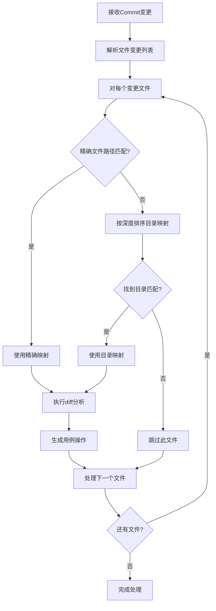
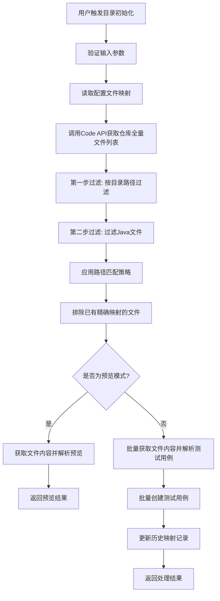

# 目录路径映射功能设计方案

## 📋 需求背景

### 现状问题
- 配置文件只支持：`具体文件全路径:测试管理目录路径`
- 用户需要一个一个文件手动映射，工作量大
- 缺乏批量映射能力

### 目标功能
- 支持：`目录路径:测试管理目录路径` 
- 实现批量映射效果
- 支持路径匹配优先级（越深越优先）
- 提供目录初始化功能

---

## 🎯 方案设计

### 1. 配置文件结构扩展

#### 1.1 扩展后的配置格式
```json
{
  "mappings": {
    // 现有的精确文件映射（保持兼容）
    "src/test/java/com/cfca/service/UserServiceTest.java": "/测试管理/用户服务/用户服务测试",
    "src/test/java/com/cfca/service/OrderServiceTest.java": "/测试管理/订单服务/订单服务测试",
    
    // 新增的目录映射
    "src/test/java/com/cfca/service/": "/测试管理/服务层测试",
    "src/test/java/com/cfca/controller/": "/测试管理/控制器测试",
    "src/test/java/com/cfca/util/": "/测试管理/工具类测试",
    "src/test/java/com/cfca/": "/测试管理/CFCA项目测试",
    "src/test/java/": "/测试管理/Java测试"
  }
}
```

#### 1.2 映射类型识别
- **文件映射**：路径不以 `/` 结尾，如 `src/test/java/UserTest.java`
- **目录映射**：路径以 `/` 结尾，如 `src/test/java/com/cfca/`

---

### 2. 路径匹配策略

#### 2.1 匹配优先级（从高到低）
1. **精确文件路径匹配**：`src/test/java/com/cfca/service/UserServiceTest.java`
2. **最深目录路径匹配**：`src/test/java/com/cfca/service/`
3. **较浅目录路径匹配**：`src/test/java/com/cfca/`
4. **最浅目录路径匹配**：`src/test/java/`

#### 2.2 匹配算法设计
```typescript
function findBestMapping(filePath: string, mappings: Record<string, string>): string | null {
  // 1. 优先精确文件匹配
  if (mappings[filePath]) {
    return mappings[filePath];
  }
  
  // 2. 目录匹配：按路径深度降序排列
  const directoryMappings = Object.keys(mappings)
    .filter(key => key.endsWith('/'))
    .sort((a, b) => b.split('/').length - a.split('/').length);
  
  // 3. 找到第一个匹配的目录
  for (const dirPath of directoryMappings) {
    if (filePath.startsWith(dirPath)) {
      return mappings[dirPath];
    }
  }
  
  return null;
}
```

#### 2.3 匹配示例
```
文件：src/test/java/com/cfca/service/UserServiceTest.java

匹配过程：
1. 检查精确匹配：src/test/java/com/cfca/service/UserServiceTest.java ❌
2. 检查目录匹配（按深度排序）：
   - src/test/java/com/cfca/service/ ✅ (匹配成功)
   - src/test/java/com/cfca/ (不再检查)
   - src/test/java/ (不再检查)

结果：使用 /测试管理/服务层测试
```

---

### 3. 功能模块设计

#### 3.1 路径匹配增强模块
**文件：** `src/trigger/modules/automation/pathMappingEnhanced.ts`

**功能：**
- 扩展现有的路径匹配逻辑
- 支持目录路径匹配
- 实现优先级排序

**核心方法：**
```typescript
export class EnhancedPathMapping {
  // 查找最佳映射
  findBestMapping(filePath: string, mappings: Record<string, string>): string | null
  
  // 验证映射配置
  validateMappings(mappings: Record<string, string>): ValidationResult
  
  // 获取目录映射列表
  getDirectoryMappings(mappings: Record<string, string>): DirectoryMapping[]
  
  // 预览文件匹配结果
  previewFileMapping(filePath: string, mappings: Record<string, string>): MatchResult
}
```

#### 3.2 目录初始化模块
**文件：** `src/trigger/modules/automation/directoryInitializer.ts`

**功能：**
- 调用Code API获取全量文件列表
- 根据目录映射过滤需要初始化的文件
- 排除已映射的文件
- 批量初始化测试用例

**核心方法：**
```typescript
export class DirectoryInitializer {
  // 获取仓库全量文件列表
  getRepositoryAllFiles(repositoryId: string, branch: string): Promise<string[]>
  
  // 第一步过滤：按目录路径过滤文件
  filterFilesByDirectory(allFiles: string[], directoryPath: string): string[]
  
  // 第二步过滤：过滤Java文件
  filterJavaFiles(directoryFiles: string[]): string[]
  
  // 第三步过滤：通过内容检查是否包含测试用例
  filterTestFilesByContent(javaFiles: string[], repositoryId: string, branch: string): Promise<string[]>
  
  // 完整的三步过滤流程
  getDirectoryTestFiles(repositoryId: string, branch: string, directoryPath: string): Promise<string[]>
  
  // 批量初始化测试用例
  initializeDirectory(params: DirectoryInitParams): Promise<InitializeResult>
  
  // 预览初始化结果
  previewInitialization(params: PreviewParams): Promise<PreviewResult>
}
```

#### 3.3 Code API增强模块
**文件：** `src/trigger/modules/automation/codeApiEnhanced.ts`

**功能：**
- 封装文件列表获取API
- 批量文件内容获取

**核心方法：**
```typescript
export class CodeApiEnhanced {
  // 获取仓库全量文件列表
  getRepositoryFiles(projectId: string, ref: string, search?: string): Promise<string[]>
  
  // 批量获取文件内容
  getMultipleFileContents(projectId: string, filePaths: string[], ref?: string): Promise<FileContent[]>
  
  // 检查文件是否为Java测试文件
  isJavaTestFile(filePath: string, content?: string): Promise<boolean>
}
```

---

### 4. 核心流程设计

#### 4.1 Commit处理流程（增强版）


#### 4.2 目录初始化流程（新增）


**关键过滤步骤详解：**

**步骤E - 第一步过滤（目录范围过滤）：**
```typescript
// 从仓库全量文件中过滤出指定目录下的文件
function filterByDirectoryPath(allFiles: string[], directoryPath: string): string[] {
  return allFiles.filter(file => {
    // 确保文件在指定目录下
    return file.startsWith(directoryPath);
  });
}

// 示例：
// 全量文件: ["src/main/java/User.java", "src/test/java/UserTest.java", "docs/README.md"]
// 目录路径: "src/test/java/"
// 过滤结果: ["src/test/java/UserTest.java"]
```

**步骤F - 第二步过滤（Java文件过滤）：**
```typescript
// 从目录文件中过滤出Java文件
function filterJavaFiles(directoryFiles: string[]): string[] {
  return directoryFiles.filter(file => {
    // 只过滤.java文件
    return file.endsWith('.java');
  });
}

// 示例：
// 目录文件: ["src/test/java/UserTest.java", "src/test/java/User.java", "src/test/java/util/Helper.java", "src/test/resources/config.xml"]
// 过滤结果: ["src/test/java/UserTest.java", "src/test/java/User.java", "src/test/java/util/Helper.java"]
```

**步骤G - 解析测试用例（合并内容检查）：**
```typescript
// 在解析过程中自然筛选出包含测试用例的文件
async function parseTestCasesFromFiles(javaFiles: string[], repositoryId: string, branch: string): Promise<ParseResult[]> {
  const results: ParseResult[] = [];
  
  for (const filePath of javaFiles) {
    try {
      // 获取文件内容
      const fileContent = await getFileContent(repositoryId, filePath, branch);
      
      // 使用现有的解析逻辑解析测试用例
      const testMethods = javaParser.parseTestMethods(fileContent);
      
      if (testMethods.length > 0) {
        // 如果文件包含测试用例，则添加到结果中
        results.push({
          filePath,
          testCases: testMethods,
          status: 'success'
        });
      } else {
        // 如果文件不包含测试用例，记录但不处理
        console.log(`[DirectoryInit] 文件 ${filePath} 不包含测试用例，跳过`);
      }
    } catch (error) {
      console.warn(`解析文件失败: ${filePath}`, error);
      results.push({
        filePath,
        testCases: [],
        status: 'error',
        error: error.message
      });
    }
  }
  
  return results;
}

// 这样就避免了重复获取文件内容，直接在解析过程中完成筛选
```

---

### 5. API接口设计

#### 5.1 目录初始化接口
```typescript
// 执行目录初始化
POST /trigger/automation/initialize-directory

Request Body:
{
  repositoryId: string,          // 仓库ID
  branch: string,                // 分支名称
  directoryPath: string,         // 要初始化的目录路径
  targetPath: string,            // 测试管理目标路径
  dryRun?: boolean,             // 是否为预览模式
  excludeFiles?: string[],       // 排除的文件列表
  includeSubdirectories?: boolean // 是否包含子目录
}

Response:
{
  success: boolean,
  data: {
    totalFiles: number,          // 总文件数
    processedFiles: number,      // 已处理文件数
    createdCases: number,        // 创建的用例数
    skippedFiles: string[],      // 跳过的文件（已有映射）
    errors: Array<{              // 处理错误
      file: string,
      error: string,
      details?: any
    }>,
    duration: number,            // 处理耗时（秒）
    mappingUpdated: boolean      // 是否更新了映射配置
  }
}
```

#### 5.2 目录映射预览接口
```typescript
// 预览目录映射结果
GET /trigger/automation/preview-directory-mapping
  ?repositoryId=xxx
  &branch=xxx
  &directoryPath=xxx
  &targetPath=xxx

Response:
{
  success: boolean,
  data: {
    matchedFiles: string[],      // 匹配的文件列表
    existingMappings: Array<{    // 已有映射的文件
      file: string,
      currentMapping: string
    }>,
    newFiles: string[],          // 新文件列表
    estimatedCases: number,      // 预估用例数量
    conflictFiles: Array<{       // 冲突文件
      file: string,
      conflicts: string[]
    }>
  }
}
```

#### 5.3 映射配置验证接口
```typescript
// 验证映射配置
POST /trigger/automation/validate-mappings

Request Body:
{
  mappings: Record<string, string>  // 映射配置
}

Response:
{
  success: boolean,
  data: {
    isValid: boolean,
    errors: Array<{
      path: string,
      error: string,
      suggestion?: string
    }>,
    warnings: Array<{
      path: string,
      warning: string
    }>,
    statistics: {
      totalMappings: number,
      fileMappings: number,
      directoryMappings: number,
      maxDepth: number
    }
  }
}
```

---

### 6. 配置页面增强设计

#### 6.1 页面布局
```
┌─────────────────────────────────────────┐
│ 自动化测试映射配置                       │
├─────────────────────────────────────────┤
│ Tab1: 精确文件映射 │ Tab2: 目录映射      │
├─────────────────────────────────────────┤
│ ┌─── 精确文件映射表格 ───┐              │
│ │ 文件路径 │ 测试管理路径 │ 操作 │       │
│ │ file1.java │ /path1 │ 删除 │         │
│ │ file2.java │ /path2 │ 删除 │         │
│ └─────────────────────────┘              │
│ [+ 添加文件映射]                        │
├─────────────────────────────────────────┤
│ ┌─── 目录映射表格 ───┐                  │
│ │ 目录路径 │ 测试管理路径 │ 操作 │       │
│ │ src/test/ │ /测试目录 │ 初始化 │删除 │ │
│ │ src/main/ │ /主代码 │ 初始化 │删除 │   │
│ └─────────────────────────┘              │
│ [+ 添加目录映射]                        │
└─────────────────────────────────────────┘
```

#### 6.2 目录初始化向导
```
步骤1: 选择目录
┌─────────────────────────────────────────┐
│ 目录路径: [src/test/java/com/cfca/] [浏览] │
│ 测试管理路径: [/测试管理/CFCA测试] [选择]   │
│ □ 包含子目录                             │
│ □ 排除已映射文件                         │
│ [下一步: 预览文件]                       │
└─────────────────────────────────────────┘

步骤2: 预览文件
┌─────────────────────────────────────────┐
│ 匹配文件 (15个):                        │
│ ✓ UserServiceTest.java (3个测试用例)     │
│ ✓ OrderServiceTest.java (5个测试用例)    │
│ ✗ ExistingTest.java (已有映射)          │
│                                         │
│ 预计创建: 8个测试用例                    │
│ [上一步] [开始初始化]                   │
└─────────────────────────────────────────┘

步骤3: 执行初始化
┌─────────────────────────────────────────┐
│ 正在初始化... [████████░░] 80%           │
│ 当前处理: UserServiceTest.java           │
│ 已创建: 6个测试用例                      │
│ [取消]                                  │
└─────────────────────────────────────────┘

步骤4: 结果反馈
┌─────────────────────────────────────────┐
│ 初始化完成! ✅                          │
│ 成功处理: 12个文件                       │
│ 创建用例: 18个                          │
│ 失败文件: 1个                           │
│ [查看详情] [完成]                       │
└─────────────────────────────────────────┘
```

---

### 7. 技术实现要点

#### 7.1 性能优化策略
1. **高效三步过滤策略**
   - **第一步过滤（目录范围）**：使用字符串 `startsWith()` 快速过滤，时间复杂度O(n)
   - **第二步过滤（Java文件）**：使用文件扩展名快速判断，时间复杂度O(k)
   - **第三步过滤（测试内容检查）**：并发获取文件内容并检查@Test注解，时间复杂度O(m)
   - **过滤顺序优化**：逐步精细化过滤，避免不必要的网络请求
   - **示例性能**：10万个文件 → 1000个目录文件 → 300个Java文件 → 50个测试文件
   - **关键优化**：只有通过前两步的Java文件才会发起网络请求获取内容

2. **批量处理**
   - 并发获取文件内容（限制并发数为10）
   - 批量创建测试用例（每批50个）
   - 分片处理大量文件（每批100个文件）

3. **异步处理**
   - 目录初始化支持后台异步执行
   - 进度实时推送（WebSocket或SSE）
   - 支持任务暂停和恢复

#### 7.2 错误处理机制
1. **容错设计**
   - 单个文件处理失败不影响整体流程
   - 详细的错误分类和描述
   - 支持部分成功的结果

2. **重试机制**
   - 网络请求失败自动重试（最多3次）
   - 文件解析失败记录并跳过
   - 支持手动重试失败的文件

3. **日志记录**
   - 详细的操作日志记录
   - 错误堆栈追踪
   - 性能指标统计

#### 7.3 兼容性保证
1. **向后兼容**
   - 现有精确文件映射完全保持
   - 配置文件格式向下兼容
   - API接口向后兼容

2. **渐进式升级**
   - 支持混合使用新旧映射方式
   - 平滑的功能切换
   - 配置迁移向导

---

### 8. 数据结构定义

#### 8.1 TypeScript接口定义
```typescript
// 映射配置接口
interface MappingConfig {
  mappings: Record<string, string>;
}

// 目录初始化参数
interface DirectoryInitParams {
  repositoryId: string;
  branch: string;
  directoryPath: string;
  targetPath: string;
  dryRun?: boolean;
  excludeFiles?: string[];
  includeSubdirectories?: boolean;
}

// 初始化结果
interface InitializeResult {
  totalFiles: number;
  processedFiles: number;
  createdCases: number;
  skippedFiles: string[];
  errors: ProcessingError[];
  duration: number;
  mappingUpdated: boolean;
}

// 文件匹配结果
interface MatchResult {
  filePath: string;
  matchedMapping: string | null;
  matchType: 'exact' | 'directory' | 'none';
  priority: number;
  conflictMappings?: string[];
}

// 预览结果
interface PreviewResult {
  matchedFiles: string[];
  existingMappings: ExistingMapping[];
  newFiles: string[];
  estimatedCases: number;
  conflictFiles: ConflictFile[];
}
```

---

### 9. 实施计划

#### Phase 1: 核心路径匹配逻辑 (1-2天)
- [ ] 实现增强的路径匹配算法
- [ ] 添加优先级排序逻辑
- [ ] 编写单元测试覆盖各种匹配场景
- [ ] 更新现有的commit处理流程

#### Phase 2: Code API集成 (1-2天)
- [ ] 封装文件列表获取API
- [ ] 实现文件过滤和缓存机制
- [ ] 添加批量文件内容获取功能
- [ ] 错误处理和重试机制

#### Phase 3: 目录初始化功能 (2-3天)
- [ ] 实现目录初始化核心逻辑
- [ ] 添加预览功能
- [ ] 实现批量测试用例创建
- [ ] 添加进度跟踪和错误处理

#### Phase 4: API接口开发 (1-2天)
- [ ] 开发目录初始化API
- [ ] 实现预览接口
- [ ] 添加配置验证接口
- [ ] API文档和测试

#### Phase 5: 前端页面开发 (2-3天)
- [ ] 扩展配置页面支持目录映射
- [ ] 实现初始化向导界面
- [ ] 添加预览和进度展示功能
- [ ] 用户交互优化

#### Phase 6: 集成测试和优化 (1-2天)
- [ ] 端到端测试
- [ ] 性能测试和优化
- [ ] 错误场景测试
- [ ] 文档和使用指南

---

### 10. 风险评估和缓解措施

#### 10.1 技术风险
| 风险 | 影响 | 概率 | 缓解措施 |
|------|------|------|----------|
| Code API性能问题 | 高 | 中 | 实现缓存和批量处理 |
| 大量文件处理超时 | 中 | 高 | 分片处理和异步执行 |
| 映射冲突处理复杂 | 中 | 中 | 清晰的优先级规则和用户提示 |

#### 10.2 业务风险
| 风险 | 影响 | 概率 | 缓解措施 |
|------|------|------|----------|
| 用户配置错误 | 高 | 中 | 提供预览和验证功能 |
| 批量创建用例错误 | 高 | 低 | 详细的错误处理和回滚机制 |
| 性能影响现有功能 | 中 | 低 | 独立的处理队列和资源限制 |

---

### 11. 成功指标

#### 11.1 功能指标
- [ ] 支持目录路径映射配置
- [ ] 路径匹配准确率 > 95%
- [ ] 批量初始化成功率 > 90%
- [ ] 向后兼容性 100%

#### 11.2 性能指标
- [ ] 1000个文件初始化完成时间 < 5分钟
- [ ] 文件列表获取响应时间 < 10秒
- [ ] 映射匹配响应时间 < 1秒
- [ ] 内存使用增长 < 20%

#### 11.3 用户体验指标
- [ ] 配置操作步骤减少 > 80%
- [ ] 用户满意度 > 4.5/5
- [ ] 功能采用率 > 60%
- [ ] 错误率 < 5%

---

## 📝 附录

### A. 配置示例

#### A.1 典型映射配置
```json
{
  "mappings": {
    // 服务层测试
    "src/test/java/com/cfca/service/": "/测试管理/服务层测试",
    "src/test/java/com/cfca/service/user/UserService.java": "/测试管理/用户服务/核心测试",
    
    // 控制器测试
    "src/test/java/com/cfca/controller/": "/测试管理/接口测试",
    
    // 工具类测试
    "src/test/java/com/cfca/util/": "/测试管理/工具类测试",
    
    // 通用Java测试
    "src/test/java/": "/测试管理/Java单元测试"
  }
}
```

#### A.2 复杂场景示例
```json
{
  "mappings": {
    // 多层级目录映射
    "src/test/java/com/cfca/payment/": "/测试管理/支付模块",
    "src/test/java/com/cfca/payment/alipay/": "/测试管理/支付模块/支付宝",
    "src/test/java/com/cfca/payment/wechat/": "/测试管理/支付模块/微信支付",
    
    // 特殊文件映射
    "src/test/java/com/cfca/payment/PaymentCoreTest.java": "/测试管理/支付模块/核心测试/支付核心",
    
    // 集成测试映射
    "src/test/java/integration/": "/测试管理/集成测试"
  }
}
```

### B. 两步过滤流程完整示例

#### B.1 实际场景演示
```typescript
// 场景：初始化 src/test/java/com/cfca/service/ 目录

// 1. Code API返回的仓库全量文件列表（示例）
const allRepositoryFiles = [
  "README.md",
  "pom.xml",
  "src/main/java/com/cfca/service/UserService.java",
  "src/main/java/com/cfca/service/OrderService.java",
  "src/main/java/com/cfca/controller/UserController.java",
  "src/test/java/com/cfca/service/UserServiceTest.java",
  "src/test/java/com/cfca/service/OrderServiceTest.java",
  "src/test/java/com/cfca/service/BaseServiceTest.java",
  "src/test/java/com/cfca/controller/UserControllerTest.java",
  "src/test/java/com/cfca/util/StringUtilTest.java",
  "src/test/resources/application.yml",
  "docs/api.md"
];

// 2. 第一步过滤：按目录路径过滤
const directoryPath = "src/test/java/com/cfca/service/";
const directoryFiles = allRepositoryFiles.filter(file => 
  file.startsWith(directoryPath)
);
// 结果：[
//   "src/test/java/com/cfca/service/UserServiceTest.java",
//   "src/test/java/com/cfca/service/OrderServiceTest.java", 
//   "src/test/java/com/cfca/service/BaseServiceTest.java"
// ]

// 3. 第二步过滤：过滤Java文件
const javaFiles = directoryFiles.filter(file => {
  // 只过滤.java文件，不判断是否为测试文件
  return file.endsWith('.java');
});
// 结果：[
//   "src/test/java/com/cfca/service/UserServiceTest.java",
//   "src/test/java/com/cfca/service/OrderServiceTest.java",
//   "src/test/java/com/cfca/service/BaseServiceTest.java"  
// ]

// 4. 第三步过滤：检查文件内容是否包含@Test注解
const testFiles = [];
for (const javaFile of javaFiles) {
  const fileContent = await getFileContent(repositoryId, javaFile, branch);
  if (fileContent.includes('@Test')) {
    testFiles.push(javaFile);
  }
}
// 假设检查后发现BaseServiceTest.java实际上是个基础类，不包含@Test注解
// 结果：[
//   "src/test/java/com/cfca/service/UserServiceTest.java",
//   "src/test/java/com/cfca/service/OrderServiceTest.java"
// ]

// 5. 最终获得需要初始化的文件列表
console.log(`从 ${allRepositoryFiles.length} 个文件中过滤出 ${testFiles.length} 个包含测试用例的文件`);
// 输出：从 12 个文件中过滤出 2 个包含测试用例的文件
```

#### B.2 性能对比分析
```
假设场景：大型项目仓库
- 仓库总文件数：50,000 个文件
- 目标目录：src/test/java/com/company/service/

传统方案（全量内容检查）：
- 需要获取每个文件的内容并检查@Test注解
- 网络请求：50,000次
- 预估耗时：10-30分钟（受网络延迟影响）

优化方案（三步过滤）：
- 第一步过滤：50,000 → 200 个文件（目录范围过滤）
- 第二步过滤：200 → 80 个Java文件（文件扩展名过滤）
- 第三步过滤：80 → 30 个测试文件（内容检查，需要网络请求）
- 网络请求：仅80次（减少99.84%）
- 预估耗时：10-30秒

性能提升：20-60倍

关键优化点：
- 避免了对非目标目录文件的无意义网络请求
- 避免了对非Java文件的内容检查
- 大幅减少了网络I/O操作
```

### C. 错误代码定义
```typescript
enum DirectoryMappingErrorCode {
  INVALID_DIRECTORY_PATH = 'INVALID_DIRECTORY_PATH',
  TARGET_PATH_NOT_FOUND = 'TARGET_PATH_NOT_FOUND',
  API_REQUEST_FAILED = 'API_REQUEST_FAILED',
  FILE_PARSE_ERROR = 'FILE_PARSE_ERROR',
  BATCH_CREATE_FAILED = 'BATCH_CREATE_FAILED',
  MAPPING_CONFLICT = 'MAPPING_CONFLICT',
  INSUFFICIENT_PERMISSIONS = 'INSUFFICIENT_PERMISSIONS'
}
```

---

**文档版本：** v1.0  
**创建时间：** 2025-09-18  
**最后更新：** 2025-09-18  
**负责人：** 开发团队